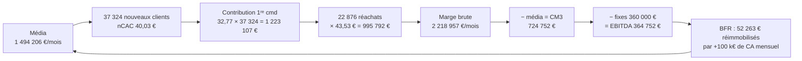

# Module E00 — Le cadrage : ce métier, vraiment

> **Prérequis :** aucun. C'est le module d'entrée du cursus.
> Lecture en parallèle recommandée : [module racine 01 — Les asymétries d'information](../../modules/01-asymetries-information.md).
> **Objet :** à la fin, tu sais dire ce qu'est physiquement une marque DTC à 1 M€ de CA par semaine, quel capital elle exige, par quels cinq mécanismes elle meurt, et si ta catégorie t'autorise seulement à y prétendre.
> **Temps de travail :** ~4 h (lecture + exercices)

---

## 0. Pourquoi ce module existe

Une marque en direct-au-consommateur — DTC, *direct-to-consumer* : tu vends toi-même, sans distributeur — n'est pas un magasin. C'est **une machine qui transforme du capital en clients, les clients en marge de contribution, et la marge de contribution en capital à nouveau**. Le nom, le packaging, le ton du compte Instagram n'existent que pour régler le rendement de cette conversion.

La machine se juge sur deux nombres, et deux seulement.

1. **Le taux de conversion capital → marge de contribution.** Chez NØRA au palier P5, 1 494 206 € de média par mois achètent 37 324 nouveaux clients (chiffres canoniques § 2.4 et § 5). Ces clients produisent 86,75 € de contribution chacun sur 12 mois (§ 3) : `37 324 × 86,75 = 3 237 857 €`. Un euro de média revient à 2,17 € de marge de contribution en douze mois — exactement le ratio LTV/CAC de 2,17 du § 3.1, atteint par un autre chemin.
2. **La vitesse à laquelle ce capital revient.** Le délai de récupération du CAC — *payback*, temps au bout duquel la marge cumulée d'un client rembourse son coût d'acquisition — est de **1,8 mois** à P5 (§ 3). Une machine à 2,17 avec un payback de 18 mois est en faillite ; la même avec un payback de 1,8 mois s'autofinance.

Un ratio sans vitesse ne vaut rien. Une vitesse sans ratio non plus.

> **À retenir :** tu ne construis pas une marque, tu construis un convertisseur de capital. La marque est le composant qui empêche son rendement de s'effondrer quand les concurrents copient.

---

## 1. Les quatre façons de gagner de l'argent en e-commerce

Reviens au module racine 01 : **la marge est le prix d'une asymétrie**. Tu es payé parce que tu sais, peux ou supportes quelque chose que l'acheteur ne sait, ne peut ou ne veut pas supporter. Les quatre modèles ci-dessous ne se distinguent que par l'asymétrie détenue — donc par la vitesse à laquelle elle se referme.

Une formule d'abord. Le **coefficient** d'un produit est `PVC TTC ÷ COGS` (COGS : *cost of goods sold*, coût marchandise rendu entrepôt). Avec la TVA de 20 % du modèle canonique :

```
COGS en % du CA HT = COGS ÷ (PVC TTC ÷ 1,2) = 1,2 ÷ coefficient
```

Contrôle sur le Sérum Densité (§ 1) : coefficient ×8,1, donc `1,2 ÷ 8,1 = 14,8 %` ; le tableau donne `4,80 ÷ 32,50 = 14,8 %`.

### 1.1 (a) L'arbitrage produit — meurt en 6 à 18 mois

Tu achètes moins cher, tu revends plus cher, sans rien construire. Ton asymétrie est **purement informationnelle** : tu sais où trouver le produit, l'acheteur non. Le module 01 l'a déjà établi — c'est l'asymétrie qui se referme le plus vite, parce que sa reproduction ne coûte rien à ton copieur.

Chiffrons la mort. Structure de coût variable de NØRA à P5 hors COGS (§ 2.1) : logistique 11,0 % + PSP 1,55 % + retours/SAV 3,5 % + remises 8,0 % = **24,05 % du CA HT**. Ce bloc ne dépend pas de ton coefficient : quoi que tu vendes, il faut l'expédier, l'encaisser, gérer les retours et remiser.

Le **MER seuil** — MER, *marketing efficiency ratio* = CA TTC ÷ dépense publicitaire — au-delà duquel la marge après publicité (CM3) devient positive se dérive ainsi :

```
CM3 = 0  ⟺  pub = marge brute = MB% × CA HT = MB% × CA TTC ÷ 1,2
MER seuil (CM3 = 0)     = 1,2 ÷ MB%
MER seuil (EBITDA = 0)  = 1,2 ÷ (MB% − frais fixes en % du CA HT)
```

Contrôle sur les cinq paliers canoniques (§ 2.1, § 2.3, § 2.5) :

| Palier | MB% | Fixes % | 1,2 ÷ MB% | § 2.3 | 1,2 ÷ (MB − fixes) | § 2.3 |
| --- | ---: | ---: | ---: | ---: | ---: | ---: |
| P1 | 57,2 % | 21,2 % | 2,10 | 2,10 | 3,33 | 3,33 |
| P2 | 58,8 % | 14,6 % | 2,04 | 2,04 | 2,71 | 2,71 |
| P3 | 60,3 % | 10,7 % | 1,99 | 1,99 | 2,42 | 2,42 |
| P4 | 60,4 % | 9,4 % | 1,99 | 1,99 | 2,35 | 2,35 |
| P5 | 61,5 % | 10,0 % | 1,95 | 1,95 | 2,33 | 2,33 |

Dix valeurs sur dix. Applique donc la formule à n'importe quel coefficient, avec la structure de coût P5 :

| Coefficient | COGS % HT | Marge brute | MER seuil CM3 = 0 | MER seuil EBITDA = 0 | Verdict |
| ---: | ---: | ---: | ---: | ---: | --- |
| ×2,5 | 48,0 % | 27,95 % | 4,29 | 6,69 | impossible |
| ×3 | 40,0 % | 35,95 % | 3,34 | 4,62 | impossible |
| ×4 | 30,0 % | 45,95 % | 2,61 | 3,34 | très fragile |
| ×5 | 24,0 % | 51,95 % | 2,31 | 2,86 | limite basse |
| ×6,4 | 18,75 % | 57,20 % | 2,10 | 2,54 | jouable |
| ×8,1 | 14,8 % | 61,15 % | 1,96 | 2,35 | confortable |

Le MER réellement atteint par NØRA va de 1,80 à 2,90 selon le palier (§ 2.3). Un produit à ×3 exige 3,34 pour seulement couvrir sa publicité : **il demande à la machine publicitaire un rendement qu'elle ne délivre jamais à ce volume**. Ce n'est pas une question d'effort, c'est une inégalité arithmétique.

L'arbitrage tourne entre ×2,5 et ×3,5 : s'il pouvait tourner à ×8, dix personnes s'y engouffreraient en un trimestre. Il tient tant que peu d'annonceurs enchérissent sur la même audience avec le même angle. Dès que trois concurrents copient la créative, l'enchère monte, le CAC monte, le MER passe sous le seuil. **La seule barrière était l'ignorance des autres, et elle a une durée de vie de deux à six mois par angle.** C'est la ligne du § 1 des canoniques — sous ×5, une marque DTC qui achète son trafic ne survit pas à l'échelle — démontrée plutôt qu'assénée.

### 1.2 (b) La marque — la seule voie vers P5

L'asymétrie n'est plus informationnelle mais **préférentielle** : l'acheteur sait qu'il existe moins cher et prend la tienne quand même. Ce n'est pas de l'irrationalité, c'est une économie de coût de recherche et de risque perçu — le signal de Spence du module 01, coûteux donc crédible.

Ce que ça vaut. Marge brute de NØRA à P5 (61,5 %, § 2.1) contre un arbitrage à ×3 dans la même structure (35,95 %) : 25,55 points d'écart.

```
3 610 997 € de CA HT × 25,55 % = 922 610 € / mois × 12 = 11 071 320 € / an
```

L'EBITDA annuel de NØRA à P5 est de 4 377 023 € (§ 7). **L'asymétrie de marque vaut 2,53 fois le profit total.** Sans elle il n'y a pas « moins de profit » : il y a un trou de `11 071 320 − 4 377 023 = 6 694 297 €` et une liquidation.

C'est aussi la seule des quatre voies dont les termes s'améliorent avec la taille : le COGS se négocie (20,0 % du CA HT à P1, 14,5 % à P5, § 2.1), le coût du clic de marque baisse, et le réachat monte à 44,9 % du CA à P5 (§ 8).

### 1.3 (c) La distribution — posséder l'accès

Asymétrie **positionnelle** : tu es l'endroit où la demande passe. Communauté propriétaire, base e-mail, rayon physique, place de marché, réseau d'affiliés.

Le § 5 la chiffre. Le nCAC — coût d'acquisition d'un *nouveau* client — vaut 38,50 € sur Meta et **19,00 € sur Google Search + Shopping**, soit `1 − 19,00 ÷ 38,50 = 50,6 %` moins cher. Non parce que Google serait meilleur, mais parce que Search **récolte** une demande créée ailleurs : celui qui tape le nom d'une catégorie a déjà été convaincu par quelqu'un, le plus souvent par la marque, à ses frais. Acquérir les 37 324 nouveaux clients au tarif de la récolte vaudrait `37 324 × (40,03 − 19,00) = 784 924 €` par mois, soit 9 419 088 € par an — 2,15 fois l'EBITDA annuel. Personne ne capture ce montant en entier, la demande récoltée devant d'abord avoir été créée ; mais l'ordre de grandeur dit pourquoi posséder une audience directe change l'économie. Ce modèle passe l'échelle ; il se construit lentement et se loue mal.

### 1.4 (d) L'infrastructure — vendre aux vendeurs

Asymétrie **structurelle** : tu prélèves sur le volume des autres sans porter leur stock, leur CAC ni leur risque de mode. Regarde ce que l'infrastructure encaisse sur NØRA à P5, en un mois, sur un seul client :

| Fournisseur | Base | Montant / mois |
| --- | --- | ---: |
| Plateformes publicitaires | § 2.2 | 1 494 206 € |
| Logistique (11,0 % du CA HT) | § 2.1 | 397 210 € |
| Prestataire de paiement (1,55 % du CA HT) | § 2.1 | 55 970 € |
| **Total capté par l'infrastructure** | | **1 947 386 €** |
| Pour mémoire — EBITDA de NØRA | § 2.2 | 364 752 € |

`1 947 386 ÷ 364 752 = 5,34`. **Les fournisseurs captent 5,34 € pour chaque euro d'EBITDA que NØRA conserve** — sans BFR, sans retours, sans plateau créatif.

### 1.5 Le verdict

| Modèle | Asymétrie détenue | Durée de vie | Passe l'échelle ? | Atteint P5 ? |
| --- | --- | --- | --- | --- |
| (a) Arbitrage produit | Information sur la source | 6 à 18 mois | non | non |
| (b) Marque | Préférence construite | années, si entretenue | oui | oui |
| (c) Distribution | Accès à la demande | longue, dure à bâtir | oui | oui, plus lentement |
| (d) Infrastructure | Position sur le flux | très longue | oui | oui, sans BFR |

Le cursus enseigne (b), parce que c'est ce que tu as demandé et parce que c'est la seule voie qui, partie de zéro sans audience ni compétence logicielle, mène à 1 M€/semaine sur un produit physique. Mais l'honnêteté impose de le dire : **(d) a de meilleurs unit economics que (b), et si ton avantage réel est technique plutôt que créatif, (b) est le mauvais choix.** Voir [E02](E02-marche-et-produit.md) et [E12](E12-marque-et-actif.md).

---

## 2. Ce que 1 M€ par semaine veut dire physiquement

### 2.1 La journée type au palier P5

| Grandeur | Valeur | Origine |
| --- | ---: | --- |
| CA TTC / semaine | 999 968 € | § 2 |
| CA TTC / an | 51 998 336 € | dérivé : 999 968 × 52 |
| CA HT / mois | 3 610 997 € | § 2.2 |
| Commandes / jour | 1 984 | dérivé : 999 968 ÷ 71,98 ÷ 7 |
| Dépense publicitaire / jour | 49 151 € | § 5 |
| Concepts publicitaires nouveaux / semaine | 57 | § 6 |
| Dont gagnants / semaine | 5,2 | § 6 |
| Assets créatifs produits / mois | 1 245 | § 6 |
| ETP (équivalents temps plein) | 38 | § 2.5 |
| BFR immobilisé en permanence | 2 264 655 € | § 4 |
| EBITDA / mois | 364 752 € | § 2.2 |
| **EBITDA en % du CA HT** | **10,1 %** | § 2.2 |

Lis la colonne du milieu lentement. **Chaque jour**, sept jours sur sept, 1 984 commandes sortent d'un entrepôt, 49 151 € partent en publicité, et il faut avoir produit huit concepts nouveaux pour tenir le rythme de 57 par semaine. Une journée de rupture sur le produit héros, un week-end sans campagne active, et le rattrapage se compte en centaines de milliers d'euros (§ 4.5).

### 2.2 L'écart entre l'ego et l'entreprise

Ramène tout à la commande. NØRA fait 60 200 commandes par mois à P5 (§ 2) :

```
Marge brute par commande = 2 218 957 € ÷ 60 200 =   36,86 €
Publicité par commande   = 1 494 206 € ÷ 60 200 = − 24,82 €
                                                  ---------
CM3 par commande                                     12,04 €
Frais fixes par commande =   360 000 € ÷ 60 200 = −   5,98 €
                                                  ---------
EBITDA par commande                                   6,06 €
```

Contrôle : `6,06 × 60 200 = 364 812 €` contre 364 752 € au § 2.2, soit 0,02 % d'écart d'arrondi.

Voilà l'image exacte. **Une entreprise qui affiche 52 M€ de CA annuel gagne 6,06 € par commande** sur un panier de 71,98 € TTC. Et elle engage 49 151 € de publicité par jour pour un EBITDA de `364 752 ÷ 30,4 = 11 998 €` par jour : **4,10 € de média pour 1 € d'EBITDA conservé.**

L'autre lecture, plus dure. Un point de CA HT vaut `3 610 997 × 1 % × 12 = 433 320 €` d'EBITDA annuel — exactement la valeur que le § 7 attribue à un point de taux de retour/SAV, ce qui confirme le calcul. L'EBITDA annuel complet représente donc `4 377 023 ÷ 433 320 = 10,1` points de CA HT. **Tout le profit annuel d'une entreprise à 52 M€ tient dans dix points de marge.** Trois points perdus en remises effacent 30 % du résultat sans qu'une ligne de chiffre d'affaires ne bouge.

> **À retenir :** le chiffre d'affaires est une unité de mesure de l'ego, la marge de contribution une unité de mesure de l'entreprise. Quand on te dit « je fais 4 M€ par mois », tu n'as reçu aucune information : tu ne sais pas si la personne gagne 364 752 € ou en perd 500 000. Demande la CM3 par commande.

### 2.3 Le vrai objectif n'est pas P5

Le § 8 met côte à côte le même chiffre d'affaires piloté deux fois : P5 à 999 968 € TTC/semaine et 10,1 % d'EBITDA, P5+ à 999 978 € TTC/semaine et 20,3 %. Écart d'EBITDA annuel : **4 428 560 €**, soit `8 805 583 ÷ 4 377 023 = 2,01` fois plus, pour zéro euro de CA supplémentaire.

La différence tient en quatre lignes du § 8 : 7 % de commandes en moins, 7 % de panier en plus, 7,6 points de réachat en plus, 15 % de dépense publicitaire en moins. Aucune ne s'obtient en poussant les budgets ; toutes s'obtiennent en travaillant l'offre ([E03](E03-offre-et-prix.md)), la rétention ([E08](E08-retention-et-ltv.md)) et la discipline promotionnelle. **Ton objectif n'est pas 1 M€/semaine, c'est P5+.**

### 2.4 Le circuit du capital



Contrôle du bouclage : `1 223 107 + 995 792 = 2 218 899 €` contre 2 218 957 € au § 2.2, soit 0,003 % d'écart. Retiens la dernière flèche : **une partie de l'EBITDA n'est jamais disponible, elle repart dans le BFR** (§ 4.2).

---

## 3. La distribution des résultats

### 3.1 Les ordres de grandeur

Aucune statistique publique fiable ne donne la distribution du CA des marques DTC européennes. Ce qui suit est une **construction raisonnée, pas une statistique sourcée** — je te donne le raisonnement pour que tu puisses le contester.

Le cursus retient comme cadre (CHARTE § 1) que **moins de 300 marques DTC natives en Europe atteignent 1 M€ de CA par semaine**. Construis la chaîne de survie à partir des cinq obstacles détaillés en § 4, chacun affecté d'une probabilité déclarée comme hypothèse :

| Étape | *Hypothèse* de franchissement | Ce qui tue |
| --- | ---: | --- |
| Trouver un produit à coefficient ≥ ×5 avec une demande réelle | 20 % | § 4.1 |
| P1 → P2 : trouver un concept publicitaire qui tient | 25 % | § 4.3 |
| P2 → P3 : financer la vallée de la mort | 30 % | § 4.2 |
| P3 → P4 : industrialiser la machine créative et l'org | 25 % | § 4.3, § 4.4 |
| P4 → P5 : multi-pays, cash, opérations | 40 % | § 4.2, § 4.5 |

```
0,20 × 0,25 × 0,30 × 0,25 × 0,40 = 0,0015  →  1 sur 667
```

Pour produire ~300 gagnantes il faut de l'ordre de `300 ÷ 0,0015 = 200 000` tentatives sérieuses — compatible avec le nombre de marques DTC lancées en Europe depuis quinze ans. Le calcul ne prouve rien ; il montre que ces cinq obstacles suffisent à expliquer la rareté sans invoquer le talent. Conséquence : **l'immense majorité des marques ne dépasse jamais quelques dizaines de milliers d'euros de CA par mois** — elles ne quittent jamais P1 (36 800 € TTC/mois) ou l'entrée de P2. Ce n'est pas un échec moral, c'est la sortie normale d'un processus dont la structure a été fixée au jour 1.

### 3.2 Pourquoi l'écart n'est pas un écart de talent

Deux opérateurs de compétence identique. Le premier a choisi une catégorie à ×8,1 et 2,24 commandes par client sur 12 mois (§ 3). Le second, ×2,5 et 1,3 commande. Regarde ce que la compétence peut encore changer.

**Le coefficient.** Le second doit atteindre un MER de 4,29 pour une CM3 nulle (§ 1.1) là où le marché lui donne 2,20 à 2,90. Aucun talent créatif ne double un MER : le MER est le produit du taux de clic, du taux de conversion et du panier, et un doublement supposerait des taux hors de toute plage observée. **Verrouillé.**

**La fréquence de réachat.** À P5, la contribution par réachat vaut 43,53 € et celle de la première commande 32,77 € (§ 3). Avec 1,3 commande sur 12 mois au lieu de 2,24 :

```
LTV 12 mois = 32,77 € + (1,3 − 1,0) × 43,53 € = 45,83 €
LTV / CAC   = 45,83 ÷ 40,03 = 1,14
```

La règle canonique (§ 3) dit : sous 1,5, on ne scale pas, on répare. Pour ramener ce ratio à 2,0 il faudrait un CAC de `45,83 ÷ 2 = 22,92 €`, soit `1 − 22,92 ÷ 40,03 = 42,7 %` sous le nCAC de NØRA. Une catégorie à faible fréquence n'est jouable qu'en récolte de demande — le nCAC de 19,00 € du Search (§ 5) — jamais en création de demande. **Verrouillé aussi.**

Ces deux verrous se posent le jour du choix de la catégorie, avant la première vente. Ils ne se déverrouillent qu'en **changeant de catégorie**, c'est-à-dire en recommençant. D'où le poids de [E02](E02-marche-et-produit.md), et sa place au début du cursus.

---

## 4. Les cinq modes de mort

### 4.1 Mode 1 — Le coefficient insuffisant

Un produit à ×2,5 ne peut mathématiquement pas payer un CAC. Démonstration au palier P2, avec sa structure réelle (§ 2.1 : logistique 14,0 % + PSP 1,70 % + retours 2,5 % + remises 5,0 % = 23,2 % hors COGS).

```
COGS        = 1,2 ÷ 2,5           = 48,0 % du CA HT
Marge brute = 100 − 48,0 − 23,2   = 28,8 %    (NØRA à P2 : 58,8 %)
AOV HT      = 57,55 € ÷ 1,2       = 47,96 €
Contribution par commande = 47,96 × 28,8 %  = 13,81 €
nCAC P2 (§ 2.4)                             = 30,78 €
Marge sur la première commande              = − 16,97 €
```

Chez NØRA au même palier, la marge sur la première commande est de −3,83 € et le payback de 1,3 mois (§ 2.4, § 3.1). Avec un ×2,5 il faut `30,78 ÷ 13,81 = 2,23` commandes pour seulement rembourser l'acquisition, avant tout frais fixe. Le compte de résultat complet, à volume P2 identique :

| Ligne | NØRA (×6,4 à ×8,1) | Produit à ×2,5 |
| --- | ---: | ---: |
| CA HT / mois | 191 833 € | 191 833 € |
| Marge brute | 112 798 € (58,8 %) | 55 248 € (28,8 %) |
| Publicité | 104 636 € | 104 636 € |
| **CM3** | **8 162 €** | **− 49 388 €** |
| Frais fixes | 28 000 € | 28 000 € |
| **EBITDA** | **− 19 838 €** | **− 77 388 €** |

L'écart, `77 388 − 19 838 = 57 550 €`, vaut exactement `191 833 € × 30,0 points`. Annualisé : **928 656 € de perte par an pour 2,3 M€ de CA HT.** Aucune optimisation de campagne ne comble 30 points de marge brute. Étude de cas : [C01](../etudes-de-cas/C01-coefficient-insuffisant.md).

### 4.2 Mode 2 — Le mur du cash

Le BFR — besoin en fonds de roulement : stock + encaissements en attente + avances publicitaires − dettes fournisseurs — est proportionnel au CA mensuel. Vérifie sur le § 4 : `2 264 655 ÷ 4 333 196 = 52,26 %`, et la colonne « cash immobilisé par +100 k€ de CA mensuel » affiche 52 263 € à P5 ; à P3, `481 053 ÷ 1 177 200 = 40,86 %` contre 40 864 €. Règle : **toute croissance du CA mensuel coûte immédiatement 40 à 59 % de cette croissance en cash immobilisé**, selon le palier.

Voilà comment une marque rentable meurt. NØRA à l'entrée de P3 — 1 177 200 € TTC/mois, EBITDA +51 033 €/mois — croît de 30 % par mois pendant six mois. *Hypothèses : ratio BFR/CA et taux d'EBITDA constants.*

```
CA TTC mensuel à M+6 = 1 177 200 × 1,30^6 = 5 682 122 €
BFR à M+6            = 5 682 122 × 40,86 % = 2 321 715 €
BFR de départ                              −   481 053 €
Cash supplémentaire à trouver              = 1 840 662 €

CA HT cumulé 6 mois = 981 000 × (1,3+1,69+2,197+2,856+3,713+4,827) = 16 270 909 €
EBITDA cumulé à 5,2 %                                              =    846 087 €
                                                                     -----------
Trou de trésorerie sur 6 mois                                           994 575 €
```

**Une marque rentable, en croissance de 30 % par mois, doit trouver 994 575 € en six mois sans avoir commis la moindre erreur.** Elle ne meurt pas de perdre de l'argent : elle meurt parce que son argent est dans des cartons et sur des comptes publicitaires — la faillite technique du § 4. La vitesse maximale sans capital externe y est écrite : à P3, la croissance autofinançable vaut 124 886 € de CA par mois, soit `124 886 ÷ 1 177 200 = 10,6 %` par mois. Au-delà, il faut du capital ou de la dette ; pas de troisième option. Voir [E10](E10-cash-et-operations.md) et [E13](E13-risque-de-ruine.md).

### 4.3 Mode 3 — Le plateau créatif

Le § 6 donne la production créative de chaque palier. Dérives-en deux choses que le tableau ne dit pas.

**Le taux de réussite baisse avec la taille.**

```
P2 : 1,7 gagnant ÷ 14 concepts = 12,1 %
P3 : 4,2 ÷ 38                  = 11,1 %
P5 : 5,2 ÷ 57                  =  9,1 %
```

**La durée de vie d'un gagnant se raccourcit.** En régime permanent, le nombre de gagnants en rotation vaut le flux de gagnants multiplié par leur durée de vie moyenne, donc `durée de vie = rotation ÷ gagnants par semaine` :

```
P2 : 9 ÷ 1,7 = 5,3 sem.   P3 : 21 ÷ 4,2 = 5,0 sem.   P5 : 23 ÷ 5,2 = 4,4 sem.
```

Un concept gagnant vit environ un mois : à P5, tu remplaces ta rotation complète toutes les 4,4 semaines, indéfiniment. Le jour où l'équipe passe de 57 à 30 concepts testés par semaine — départ du directeur artistique, budget de production coupé, angles saturés — le régime permanent se recalcule seul :

```
Gagnants/semaine     = 30 × 9,1 %  = 2,73
Gagnants en rotation = 2,73 × 4,4  = 12,0        (contre 23)
Budget par concept   = 344 817 € ÷ 12 = 28 735 €/sem., au lieu de 14 992 €
```

Deux fois plus de budget par créative sur les mêmes audiences : la fréquence double, l'usure s'accélère, le CAC monte. Ce que ça coûte : le § 7 chiffre à 1 793 047 € d'EBITDA annuel l'effet de −10 % de CAC à volume constant. La symétrie est exacte, puisque tenir le volume avec un CAC 10 % plus élevé coûte `1 494 206 × 10 % × 12 = 1 793 052 €` par an. Donc :

```
Dérive de CAC annulant tout l'EBITDA = 4 377 023 ÷ 1 793 047 × 10 % = 24,4 %
```

Et le § 2.3 annonce indépendamment un « écart au seuil EBITDA » de 24,4 % à P5. Deux chemins, le même nombre. **Une dérive de CAC de 24,4 % — 9,77 € de nCAC en plus — ramène à zéro le profit d'une entreprise à 52 M€.** Le plateau créatif n'est pas un problème de marketing, c'est un problème de survie. Voir [E05](E05-machine-creative.md) et [C03](../etudes-de-cas/C03-anatomie-creative-gagnante.md).

### 4.4 Mode 4 — La dépendance mono-canal

À P5, Meta pèse 55 % du budget et 21 346 des 41 364 nouveaux clients attribués (§ 5), lequel prévient que l'attribution totale dépasse de 11 % les 37 324 nouveaux clients réels. En répartissant uniformément :

```
Part réelle de Meta = 21 346 ÷ 41 364 = 51,6 %
Clients réels via Meta = 51,6 % × 37 324 = 19 265 / mois
```

Un mois sans Meta — compte banni, refus de vérification, changement de politique produit. Le réflexe est de calculer la perte de chiffre d'affaires du mois. C'est faux, et c'est le piège :

```
Contribution perdue le mois même = 19 265 × 32,77 € =   631 314 €
Média économisé                                     = − 821 813 €
                                                      ----------
Effet sur le cash du mois                             + 190 499 €
```

**Couper Meta améliore la trésorerie du mois.** Voilà pourquoi cette mort-là ne se voit pas venir : le tableau de bord de court terme s'améliore. La facture arrive sur les douze mois suivants :

```
LTV 12 mois des clients non acquis = 19 265 × 86,75 € = 1 671 239 €
Coût d'acquisition non engagé      = 19 265 × 40,03 € = − 771 178 €
                                                        ----------
Contribution nette détruite                              900 061 €
```

Soit `900 061 ÷ 364 752 = 2,47` mois d'EBITDA effacés par un mois de coupure. Pour les 11 jours de [C10](../etudes-de-cas/C10-compte-publicitaire-banni.md) : `900 061 × 11 ÷ 30,4 = 325 675 €`. Onze jours, un tiers de million. Traitement : [E13](E13-risque-de-ruine.md) et [E06](E06-acquisition-payante.md).

### 4.5 Mode 5 — L'effondrement opérationnel

**Les retours et le SAV.** Le § 7 chiffre un point de taux de retour/SAV à 433 320 € d'EBITDA annuel, 9,9 % du résultat. Passer de 3,5 % (§ 2.1) à 6,5 % — banal quand on ouvre un marché mal servi ou qu'on élargit trop l'audience — coûte `3 × 433 320 = 1 299 960 €` par an, **29,7 % de l'EBITDA**.

**Le stock.** Il représente `1 832 581 ÷ 2 264 655 = 80,9 %` du BFR à P5 (§ 4). Une rupture sur le produit héros amputant 20 % des commandes pendant un mois, média maintenu :

```
Commandes perdues  = 60 200 × 20 %       = 12 040
Marge brute perdue = 12 040 × 36,86 €    = 443 794 €
EBITDA du mois     = 364 752 − 443 794   = − 79 042 €
```

Un mois de rupture partielle suffit à faire passer une entreprise à 52 M€ en EBITDA négatif. Et le stock qui manque est financé par le stock qui dort : c'est le même euro.

**La densité opérationnelle.** 38 ETP pour 1 984 commandes par jour, soit 1 140 315 € de CA HT annuel par ETP (§ 2.5). Recruter 10 personnes « pour souffler » coûte `360 000 ÷ 38 × 10 × 12 = 1 136 844 €` par an : **26,0 % de l'EBITDA**. L'organisation ne se dimensionne pas au confort — [E11](E11-passage-a-echelle.md).

---

## 5. Le prix d'entrée : combien de capital, vraiment

### 5.1 La dérivation

Trois blocs : les pertes cumulées jusqu'au premier mois rentable, le BFR à financer au même moment, et ce que le modèle canonique ne compte pas.

**Pertes cumulées, mois 1 à 9** (§ 2.2 ; P1 sur M1–M3, P2 sur M4–M9) :

```
P1 : 3 mois × 9 403 €  =  28 209 €
P2 : 6 mois × 19 838 € = 119 028 €
                         ---------
Pertes cumulées M1–M9  = 147 237 €
```

**BFR à financer à M9** (§ 4) : **104 462 €**. Il n'est pas remboursé, il reste immobilisé tant que l'entreprise tourne.

**Ce que le modèle ne compte pas.** Il démarre au premier euro de vente : ni formule, ni moules, ni packaging, ni dépôt de marque, ni site, ni studio photo, ni juridique. *Hypothèse : 45 000 € HT pour une marque de soin premium à trois références* — remplace-la par ton devis réel (exercice 4).

**La marge de sécurité.** Le modèle suppose que P1 fonctionne dès le mois 1 ; il ne dit pas ce qui se passe s'il faut recommencer P1 avec un autre produit. *Hypothèse : 25 % de l'ensemble.*

| Poste | Montant HT | Origine |
| --- | ---: | --- |
| Pertes cumulées M1 à M9 | 147 237 € | dérivé de § 2.2 |
| BFR à financer à M9 | 104 462 € | § 4 |
| Lancement hors modèle | 45 000 € | *hypothèse* |
| **Sous-total** | **296 699 €** | |
| Marge de sécurité 25 % | 74 175 € | *hypothèse* |
| **Capital total à réunir** | **370 874 €** | |

Le plancher strictement canonique — sans lancement, sans sécurité — est de **251 699 €**. Tout ce qui est en dessous suppose que rien ne se passe mal.

### 5.2 « On peut démarrer avec 500 € »

À P1, le plus petit palier, la publicité coûte 20 444 € par mois (§ 2.2), soit `20 444 ÷ 30,4 = 672 €` par jour.

```
500 € ÷ 672 €/jour = 0,74 jour de publicité au plus petit palier du modèle
370 874 € ÷ 500 €  = 742
```

**500 €, c'est dix-huit heures de publicité à P1, et 1/742 du capital nécessaire.** La phrase n'est pas exagérée, elle est fausse d'un facteur 742. Elle contient pourtant une part de vérité qu'il faut dire précisément : 500 € suffisent à faire **une vente**. Ils ne suffisent pas à faire une entreprise, parce qu'entre les deux il y a neuf mois de pertes et un BFR (§ 8.5).

### 5.3 Où meurt le sous-capitalisé

*Hypothèse : le BFR se constitue linéairement à l'intérieur de chaque palier.*

```
Fin de M3 : pertes 28 209 € + BFR P1 21 603 €                      = 49 812 €
Chaque mois de P2 : 19 838 € + (104 462 − 21 603) ÷ 6 = 13 810 €   = 33 648 €
```

| Capital réuni | Épuisement | Où en est la marque |
| ---: | --- | --- |
| 50 000 € | fin M3 | Vient de valider le produit. Meurt à l'entrée de P2. |
| 100 000 € | milieu de M5 | En pleine vallée de la mort, 4 mois avant le point bas. |
| 150 000 € | fin M6 | 3 mois avant la fin de P2. |
| 251 699 € | M9 | Franchit tout juste, sans aucune réserve. |
| 370 874 € | — | Franchit avec de quoi absorber un accident. |

`(100 000 − 49 812) ÷ 33 648 = 1,49 mois` après M3, donc au milieu du mois 5. **Une marque financée à 100 000 € meurt au mois 5 alors que son modèle était juste** — et elle n'aura jamais su qu'il était juste. Mode de mort le plus fréquent et le plus injuste. Voir [C02](../etudes-de-cas/C02-vallee-de-la-mort.md).

---

## 6. Le calendrier

Le modèle canonique atteint P5 au mois 31 et le tient jusqu'au mois 40 (§ 2). Ce n'est pas une promesse et je ne t'en fais aucune : c'est ce que produit un modèle où rien n'échoue. L'intéressant est **d'où vient la durée de chaque palier**, parce que c'est là que sont les leviers.

### 6.1 P3 : la durée est une contrainte de trésorerie

Croissance autofinançable à P3 : 124 886 € de CA mensuel supplémentaire par mois (§ 4) sur une base de 1 177 200 € TTC/mois, soit **10,6 % par mois**. P3 doit mener au CA de P4, 2 931 600 € TTC/mois :

```
Multiple à franchir = 2 931 600 ÷ 1 177 200 = 2,490
Durée à 10,6 %/mois = ln(2,490) ÷ ln(1,106) = 0,9124 ÷ 0,1008 = 9,06 mois
```

Le § 2 donne P3 = M10 à M18, soit **9 mois**. La durée de P3 n'est pas une estimation : **c'est exactement la vitesse de l'autofinancement.** Injecte du capital, P3 se raccourcit ; n'en injecte pas, il dure neuf mois quoi que tu fasses.

### 6.2 P4 : la durée est une contrainte d'organisation

Même calcul : croissance autofinançable 418 046 € sur 2 931 600 €, soit 14,26 % par mois ; multiple `4 333 196 ÷ 2 931 600 = 1,478`.

```
Durée à 14,26 %/mois = ln(1,478) ÷ ln(1,1426) = 0,3908 ÷ 0,1333 = 2,93 mois
```

Le § 2 donne pourtant P4 = M19 à M30, soit **12 mois** : quatre fois plus long que ce que le cash exige. La raison est au § 2 : P4 fait passer NØRA de 2 à 5 marchés, et chaque pays rouvre un mini-P1 — créatives à retraduire, preuve sociale locale à reconstituer, logistique et retours à recâbler. Douze mois pour trois pays, quatre mois par marché, ce qui recoupe [C07](../etudes-de-cas/C07-ouverture-allemagne.md).

### 6.3 Ce qui accélère et ce qui allonge

| Facteur | Effet | Mécanisme |
| --- | --- | --- |
| Capital au-delà de 370 874 € | raccourcit P2 et P3 | lève la contrainte du § 6.1 |
| Audience préexistante | raccourcit P1 | baisse le nCAC de départ |
| Coefficient bas (×5 à ×6) | allonge tout | MER seuil plus haut (§ 1.1) |
| Réachat faible | allonge tout | LTV/CAC plus bas (§ 3.2) |
| Plateau créatif | allonge P3 et P4 | § 4.3 |
| Ouverture pays par pays | allonge P4 | § 6.2 |

Un parcours réel ajoute un échec de produit, une coupure de compte publicitaire, une rupture de stock ou un pays qui ne s'ouvre pas. *Hypothèse raisonnable : 6 à 18 mois de perte cumulée*, ce qui place l'arrivée à P5 entre le mois 37 et le mois 49 plutôt qu'au mois 31. Le modèle canonique est un plancher, jamais une attente.

---

## 7. Les trois questions à trancher avant de démarrer

**Question 1 — Quelle asymétrie je détiens ?** Formule-la ainsi : « je sais / je peux / je supporte X, que mon acheteur ne sait pas / ne peut pas / ne veut pas supporter ». Puis la seule question qui compte : combien de temps un concurrent motivé met-il à l'obtenir aussi ? Sous douze mois, tu es en § 1.1 — tu construis un arbitrage, pas une marque. Voir [module 01](../../modules/01-asymetries-information.md) et [E12](E12-marque-et-actif.md).

**Question 2 — Quel coefficient et quelle fréquence ma catégorie autorise-t-elle ?** Deux tests éliminatoires :

```
Test A — coefficient : PVC TTC ÷ COGS ≥ 5
         équivalent  : MER seuil (CM3 = 0) = 1,2 ÷ marge brute % ≤ 2,3
Test B — fréquence   : LTV 12 mois en contribution ÷ nCAC ≥ 2,0  (§ 3)
```

Une catégorie qui échoue au test A est exclue de P5, définitivement. Une catégorie qui échoue au test B n'est jouable qu'en récolte de demande, à un nCAC de l'ordre de 19 € (§ 5), donc sur un marché où la demande existe déjà — ce qui interdit la prime de marque et ramène au § 1.3.

**Question 3 — Combien puis-je perdre avant d'être obligé d'arrêter ?** Ce n'est pas ton budget : c'est le montant au-delà duquel tu vends ta maison ou tu abandonnes. Compare-le au § 5.3. S'il est inférieur à 251 699 €, tu n'as pas un projet de marque DTC financée par la publicité payante : tu as un projet qui doit trouver un autre moteur d'acquisition — organique, communauté, retail — ou une autre échelle d'ambition. Les deux se défendent. Se mentir, non.

---

## 8. Les erreurs qui coûtent cher

**8.1 Viser le chiffre d'affaires.** Le § 8 met deux entreprises au même CA — 999 968 € et 999 978 € TTC par semaine — dont l'une gagne 4 377 023 € par an et l'autre 8 805 583 €. Coût de l'erreur : **4 428 560 € par an** pour un chiffre d'affaires rigoureusement identique. Celui qui pilote le CA ne voit littéralement pas la différence entre les deux entreprises.

**8.2 Choisir un produit qu'on aime plutôt qu'un produit qui a une structure de marge.** § 4.1 : à volume P2 identique, le ×2,5 perd 77 388 € par mois là où NØRA en perd 19 838 €. Coût : **928 656 € par an**, décidés le jour du choix du produit, avant la première vente. Aucun travail ultérieur ne les récupère.

**8.3 Sous-capitaliser.** § 5.3 : 100 000 € épuisés au milieu du mois 5, quatre mois avant le point bas. Coût : la totalité des `28 209 + 4 × 19 838 = 107 561 €` déjà engagés, plus le lancement, plus les mois de travail — perdus alors que le modèle économique était valide. C'est la seule erreur de cette liste qui détruit un projet correct.

**8.4 Croire qu'un bon produit se vend seul.** Le produit de NØRA ne change pas entre P2 et P5 ; la production, si : de 14 concepts testés par semaine et 188 assets par mois à P2, à 57 concepts et 1 245 assets à P5 (§ 6), soit `1 245 × 12 = 14 940` assets par an pour vendre **trois références**. Et sur 57 concepts hebdomadaires, `57 − 5,2 = 51,8` sont jetés : 90,9 % d'échec. Un bon produit ne se vend pas seul ; il rend rentable le fait de le vendre.

**8.5 Confondre « j'ai fait une vente » et « j'ai un business ».** Une vente à P5 rapporte 12,04 € de CM3 (§ 2.2). Un salarié à 4 000 € chargés par mois exige donc `4 000 ÷ 12,04 = 332` commandes supplémentaires chaque mois pour se payer, et les 38 ETP de P5 exigent `332 × 38 = 12 616` commandes mensuelles rien que pour couvrir les salaires — 21 % du volume. Une vente est un événement ; une entreprise est un débit soutenu.

---

## 9. Ce que ce module ne dit pas

**Les modèles alternatifs.** Tout ici raisonne sur une marque DTC qui achète son trafic. Rien sur la marketplace pure (tu loues l'accès et le CAC de la plateforme : le coefficient peut descendre, mais tu ne possèdes ni le client ni le prix), le B2B2C et le retail-first (coefficient plus élevé encore pour absorber la marge du distributeur, BFR de nature différente, acquisition qui n'est plus la tienne), ni la licence (marge très haute, volume subordonné à un partenaire). Leurs seuils diffèrent de ceux du § 1.1 : ne leur applique pas ces nombres.

**Les cas où on ne veut pas de marque.** Si ton avantage réel est technique, logistique ou financier plutôt que créatif, le § 1.4 dit que l'infrastructure a de meilleurs unit economics, sans BFR ni plateau créatif. Et si ton horizon est court, la marque est le pire placement possible : un actif à amortissement lent, qui coûte cher au début (P1 et P2 perdent de l'argent volontairement, § 2.3 des canoniques) et ne rend qu'au-delà de P3.

**La sortie rapide.** Ce module raisonne en exploitation, pas en valorisation. Une marque peut se vendre avant P5, à un multiple d'EBITDA ou de CA selon la catégorie, et cette perspective change tous les arbitrages entre croissance et marge — jusqu'à rendre rationnel de sacrifier l'EBITDA pour la trajectoire. Voir [E12](E12-marque-et-actif.md).

**Les chiffres eux-mêmes.** NØRA est fictive, sur une catégorie consommable premium à coefficient élevé et réachat rapide. Une catégorie à réachat lent — mobilier, électronique, bagagerie — ne se lit pas dans ces tableaux : le payback de 1,8 mois y devient 12 mois, et toute la section 5 est à refaire. Le mécanisme reste vrai, les nombres non.

**La contradiction interne du cursus.** Ce module te dit de choisir ta catégorie sur la structure de marge. [E04](E04-psychologie-du-client.md) te dira que la préférence se construit sur une compréhension intime du client, qui suppose une proximité réelle avec la catégorie. Les deux sont vraies et se contredisent en pratique : la meilleure catégorie sur le papier est souvent celle où tu n'as aucune intuition. L'arbitrage se tranche en [E02](E02-marche-et-produit.md).

---

## 10. Le tableau de bord du module

Quatre indicateurs, dont deux se calculent avant la première vente. Tant qu'ils ne sont pas tenus, aucun autre indicateur du cursus ne sert à rien.

| # | Indicateur | Formule | Fréquence | Seuil d'alerte |
| --- | --- | --- | --- | --- |
| 1 | Coefficient produit | PVC TTC ÷ COGS rendu entrepôt | À chaque changement de tarif fournisseur | **< ×5** : le produit ne peut pas payer un CAC (§ 4.1) |
| 2 | Écart au MER seuil | MER réel ÷ (1,2 ÷ marge brute %) − 1 | Hebdomadaire | **< 0 %** : chaque euro de CA supplémentaire détruit de la marge |
| 3 | Mois de survie | Trésorerie ÷ (perte mensuelle + ΔBFR mensuel) | Mensuelle | **< 6 mois** : plus droit à un accident (§ 5.3) |
| 4 | LTV 12 mois ÷ nCAC | LTV plafonnée 12 mois en contribution ÷ nCAC | Mensuelle, par cohorte | **< 1,5** : on ne scale pas, on répare (§ 3) |

Trois précisions qui séparent un tableau de bord d'une décoration :

- L'indicateur 2 utilise le **seuil CM3 = 0** tant que tu n'es pas à P3 : avant P3, NØRA elle-même est sous son seuil EBITDA (§ 2.3), et y perdre de l'argent est une décision, pas une dérive. Après P3, bascule sur le seuil EBITDA.
- L'indicateur 3 est le seul qui se dégrade **quand tout va bien** : la croissance augmente le ΔBFR et raccourcit ta survie. Le § 4.2 en une ligne.
- L'indicateur 4 se lit **par cohorte**, jamais en moyenne : une moyenne stable masque des cohortes récentes en chute — [E08](E08-retention-et-ltv.md), [E09](E09-mesure-et-incrementalite.md).

À partir de P2, ajoute les concepts publicitaires nouveaux testés par semaine, comparés au seuil de ton palier (14 à P2, 38 à P3, 57 à P5 — § 6) : c'est l'indicateur avancé du § 4.3.

---

## 11. Exercices

À rendre dans [`E00-rendu.md`](../exercices/E00-rendu.md). Corrigé : [`E00-corrige.md`](../exercices/E00-corrige.md).

**Exercice 1 — Le seuil d'un produit à ×3,5 (données NØRA).**
Un fournisseur te propose un produit à coefficient ×3,5, que tu envisages de vendre avec la structure de coût du palier P3 (§ 2.1). Calcule en déroulant : COGS en % du CA HT, marge brute, MER seuil CM3 = 0, MER seuil EBITDA = 0. Compare au MER réel de P3 (§ 2.3) et conclus en une phrase.

**Exercice 2 — Le mois de la mort (données NØRA).**
Tu disposes de 150 000 € et tu suis exactement la trajectoire canonique P1 puis P2. Par la méthode du § 5.3 — pertes du § 2.2, constitution linéaire du BFR du § 4 — donne le mois exact où ta trésorerie atteint zéro, le nombre de mois qui te séparaient de la fin de P2, et le capital additionnel qu'il aurait fallu.

**Exercice 3 — Ton coefficient et ton seuil.**
Prends ton produit principal, ou celui que tu envisages. Écris PVC TTC, TVA applicable, PVC HT, COGS rendu entrepôt (fabrication + transport amont + douane + emballage). Calcule ton coefficient, ton COGS en % du CA HT, ta marge brute avec tes propres taux de logistique, PSP, retours et remises, puis ton MER seuil CM3 = 0.

**Exercice 4 — Le capital nécessaire à ta marque.**
Reproduis le tableau du § 5.1 avec tes chiffres : pertes cumulées jusqu'à ton premier mois d'EBITDA positif, BFR à ce moment-là (stock + encaissements en attente + avances publicitaires − dettes fournisseurs), lancement hors modèle, marge de sécurité. Donne le total, puis écris en un chiffre ton **capital de ruine** — ce que tu peux perdre sans que ta vie change. Si le second est inférieur au premier, écris ce que tu fais de cet écart : le combler, réduire l'ambition, ou changer de moteur d'acquisition.

**Exercice 5 — Décision : ma catégorie autorise-t-elle P5 ?**
Deux produits, mêmes hypothèses : AOV 60 € TTC (50 € HT), coûts variables hors COGS de 23,65 % du CA HT, nCAC de 35 €.

- **Option A** — coefficient ×7,2, fréquence de 1,2 commande par client sur 12 mois.
- **Option B** — coefficient ×4,2, fréquence de 3,1 commandes par client sur 12 mois.

Calcule pour chacune : COGS en % du CA HT, marge brute, contribution par commande, LTV 12 mois en contribution, LTV/CAC. Tranche et justifie par la règle canonique du § 3. Puis réponds à la question qui compte : **à quel nCAC l'option perdante deviendrait-elle la bonne**, et quel type de canal délivre ce nCAC (§ 5) ?

---

*Fin du module E00. Suite : [E01 — L'arithmétique de la marque](E01-arithmetique-de-la-marque.md), qui reprend le coefficient, le MER seuil et la marge de contribution et en fait des instruments de pilotage quotidien.*
