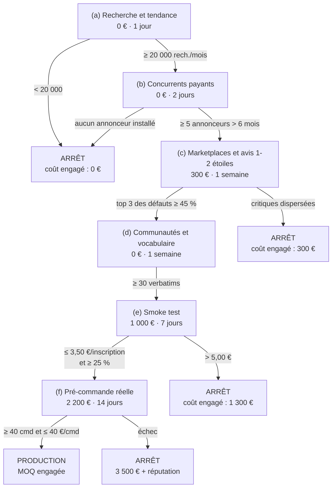

# Module E02 — Choisir le terrain : marché, catégorie, produit

> **Prérequis :** [E00](E00-cadrage.md), [E01](E01-arithmetique-de-la-marque.md). En parallèle : [module 1](../../modules/01-asymetries-information.md) du cursus racine.
> **Objet :** choisir une catégorie et un produit dont la structure économique autorise P5, et prouver la demande avant d'engager un euro de production.
> **Temps de travail :** ~5 h (lecture + exercices, calculatrice obligatoire)

---

## 0. Pourquoi ce module existe

On répète que « 80 % du résultat est décidé par le choix de catégorie ». C'est à peu près vrai et c'est mal formulé, alors formulons-le en nombres.

Prends le tableau canonique § 7 : la sensibilité de l'EBITDA annuel de P5 à une amélioration de 10 % de chaque levier. La somme des sept sensibilités vaut 71,7 + 60,8 + 41,0 + 27,3 + 14,4 + 9,9 + 9,9 = **235,0 %**. Quatre de ces leviers ont leur plafond fixé par la catégorie avant la première vente — le panier moyen atteignable (71,7 %), la fréquence de réachat (27,3 %), le coût marchandise (14,4 %) et le taux de retour (9,9 %) : **123,3 %, soit 52,5 % de la sensibilité totale.** Les trois autres — conversion, CAC, frais fixes — dépendent de ton exécution.

Donc, en sensibilité, la catégorie vaut la moitié. Mais la sensibilité n'est pas la bonne mesure, parce que quatre des cinq variables de ce module ne sont pas des curseurs : ce sont des **portes**. Sous un coefficient de ×4, le MER d'équilibre d'EBITDA vaut 3,34 alors que le MER réel d'une marque DTC se situe entre 1,80 et 2,90 (canoniques § 2.3) : aucune quantité de travail sur la conversion ne franchit un écart pareil. Au-delà d'un intervalle de consommation de 5,7 mois, le ratio LTV/CAC passe sous 2,0 quoi que tu fasses (§ 1.2). À 30 % de retours au lieu de 3,7 %, la marge brute perd 23,4 points (§ 1.3).

> **À retenir :** la catégorie ne détermine pas 80 % de ton résultat. Elle détermine **ton plafond**, et elle décide si P5 est arithmétiquement atteignable ou non. Tout ce que tu feras après décide seulement de la distance qui te sépare de ce plafond. Et cette décision-là est prise avant la première vente, avec un budget de sourcing engagé, un stock commandé et un nom déposé — c'est-à-dire au moment où tu en sais le moins et où revenir en arrière coûte le plus.

---

## 1. Les cinq variables structurelles d'une catégorie

Ce sont les cinq seules qui survivent à dix ans de croissance. Tout le reste — la tendance, la beauté du produit, l'histoire de la marque — se travaille. Ces cinq-là se subissent.

### 1.1 Le coefficient accessible (PVC TTC ÷ COGS) — seuil ×5

Le coefficient est le rapport entre le prix de vente conseillé TTC et le coût marchandise rendu entrepôt. Le canonique § 1 le donne pour NØRA : ×8,1 sur le sérum héros, ×6,4 sur le Rituel, et pose le seuil : *« sous ×5, une marque DTC qui achète son trafic ne survit pas à l'échelle »*. Voilà la démonstration.

Reprends la formule du [E01](E01-arithmetique-de-la-marque.md) § 4.1 : `MER seuil (CM3 = 0) = (1 + TVA) ÷ m`, où m est le taux de marge brute en % du CA HT. Il faut relier m au coefficient. Pose k = coefficient et t = TVA.

```
COGS en % du CA HT = COGS ÷ (PVC TTC ÷ (1 + t))
                   = (1 + t) × COGS ÷ PVC TTC
                   = (1 + t) ÷ k

Avec t = 20 % :   COGS % du CA HT = 1,20 ÷ k

m = 1 − 1,20 ÷ k − v      où v = les autres coûts variables en % du CA HT
                            (logistique + PSP + retours/SAV + remises)

MER seuil (CM3 = 0)    = 1,20 ÷ (1 − 1,20 ÷ k − v)
MER seuil (EBITDA = 0) = 1,20 ÷ (1 − 1,20 ÷ k − v − f)   où f = frais fixes ÷ CA HT
```

Applique-la avec la structure canonique de P5 : v = 11,00 + 1,55 + 3,50 + 8,00 = **24,05 %** (canonique § 2.1) et f = 360 000 ÷ 3 610 997 = **9,97 %** (canoniques § 2.2, § 2.5).

| Coefficient k | COGS % du CA HT | Marge brute m | MER seuil CM3 | MER seuil EBITDA | Marge de sécurité au MER 2,90 |
| ---: | ---: | ---: | ---: | ---: | ---: |
| ×2,5 | 48,00 % | 27,95 % | 4,29 | 6,67 | **−56,5 %** |
| ×3,0 | 40,00 % | 35,95 % | 3,34 | 4,62 | **−37,2 %** |
| ×3,5 | 34,29 % | 41,66 % | 2,88 | 3,79 | **−23,5 %** |
| ×4,0 | 30,00 % | 45,95 % | 2,61 | 3,34 | **−13,2 %** |
| ×5,0 | 24,00 % | 51,95 % | 2,31 | 2,86 | **+1,4 %** |
| ×6,0 | 20,00 % | 55,95 % | 2,14 | 2,61 | +11,1 % |
| ×6,4 | 18,75 % | 57,20 % | 2,10 | 2,54 | +14,2 % |
| ×7,0 | 17,14 % | 58,81 % | 2,04 | 2,46 | +17,9 % |
| ×8,1 | 14,81 % | 61,14 % | 1,96 | 2,35 | +23,4 % |
| ×10,0 | 12,00 % | 63,95 % | 1,88 | 2,22 | +30,6 % |

Lis la dernière colonne. À ×5, la marge de sécurité contre le MER réel de P5 vaut **+1,4 %** : un point de remise en plus, une hausse de CPM, un mois de janvier mou, et tu es à l'équilibre zéro à 1 M€ de CA par semaine. NØRA, dont le canonique § 2.3 affiche **+24,4 %** d'écart au seuil, tient parce que son coefficient blended est de ×8,28 — vérifie : 1,20 ÷ 8,28 = 14,49 % de COGS, m = 1 − 0,1449 − 0,2405 = 61,46 %, la marge brute canonique de P5 au centième près.

Inverse maintenant la question. Quel coefficient faut-il pour viser un MER seuil d'EBITDA de 2,50, c'est-à-dire garder 16 % de marge de sécurité ?

```
m − f = 1,20 ÷ 2,50 = 0,4800   →   m = 0,4800 + 0,0997 = 0,5797
1,20 ÷ k = 1 − 0,2405 − 0,5797 = 0,1798
k = 1,20 ÷ 0,1798 = 6,67
```

**×5 n'est pas la cible, c'est le mur.** La cible est ×6,7, et NØRA est au-dessus. Le canonique a raison de dire « c'est le minimum vital, pas un luxe ».

Trois précisions qui coûtent cher à ignorer. Le coefficient se calcule sur le **COGS rendu entrepôt** — produit fini, emballage primaire et secondaire, fret, douane, contrôle qualité, casse — et pas sur le prix sortie usine (§ 6.3). Il se calcule sur le **PVC TTC réellement encaissé en moyenne**, remises comprises, pas sur le prix affiché. Et il se calcule sur le **mix**, pas sur le héros : le Rituel de NØRA est à ×6,4 quand le sérum est à ×8,1 (canonique § 1) ; plus le bundle prend de part, plus le coefficient blended baisse.

### 1.2 La fréquence de réachat naturelle — le seuil est 5,7 mois

Consommable ou durable, la question n'est pas de vocabulaire. Elle a une réponse chiffrée. Reprends le canonique § 3 :

```
LTV 12 mois = contribution 1ʳᵉ commande + (n − 1) × contribution par réachat
            = 32,77 € + (2,24 − 1) × 43,53 €
            = 32,77 € + 53,98 € = 86,75 €      ✓ canonique § 3
```

Note au passage que la contribution d'un réachat (43,53 €) dépasse celle de la première commande (32,77 €) de **32,8 %** : la première commande porte la remise de bienvenue, pas les suivantes. Ta rentabilité vit dans la deuxième commande, pas la première.

La règle de décision du canonique § 3 impose LTV 12 mois ÷ nCAC ≥ 2,0. Au nCAC de P5 (40,03 €, canonique § 2.4) :

```
LTV requise = 2,0 × 40,03 = 80,06 €
n − 1 ≥ (80,06 − 32,77) ÷ 43,53 = 47,29 ÷ 43,53 = 1,086
n ≥ 2,09 commandes cumulées à 12 mois
Intervalle de consommation maximal = 12 ÷ 2,09 = 5,74 mois
```

**Voilà la porte.** Un produit dont l'intervalle naturel de reconsommation dépasse **5,7 mois** ne peut pas financer un nCAC de 40 €, quel que soit son coefficient et quelle que soit la qualité de ta publicité. NØRA est à 2,24 commandes à 12 mois : marge de 7 % au-dessus du seuil, et c'est mince. Un flacon de sérum de 50 ml se consomme en 8 à 10 semaines ; à raison d'une cure discontinue, ça donne 2 à 3 commandes par an, exactement ce que le modèle affiche.

Le test opérationnel n'est pas « est-ce que le client va aimer », c'est : **combien de jours dure une unité, et le client la remplace-t-il ou l'accumule-t-il ?** Un rasoir dure trois semaines et se remplace. Une montre dure quinze ans et s'accumule. Entre les deux, la question se tranche à la calculatrice et pas au feeling.

### 1.3 Le taux de retour structurel

Deux nombres sont constamment confondus, et la confusion vaut des points de marge. Le **taux de retour** est la part des commandes renvoyées. Le **coût des retours** est une ligne de coût variable en % du CA HT — 3,5 % chez NØRA à P5 (canonique § 2.1). Passer de l'un à l'autre demande un calcul.

Une commande retournée coûte : le chiffre d'affaires perdu, plus le traitement du retour, moins la marchandise récupérée revendable.

```
NØRA, palier P5 — hypothèses de traitement : transport retour 3,90 €,
reconditionnement 1,10 €, 10 % de la marchandise non revendable.

AOV HT           = 71,98 ÷ 1,20                        = 59,98 €
COGS par commande = 14,50 % × 59,98                    =  8,70 €
Marchandise récupérée = 0,90 × 8,70                    =  7,83 €
Coût net d'un retour = 59,98 + (3,90 + 1,10) − 7,83    = 57,15 €

Ligne « retours » canonique = 3,50 % × 59,98           =  2,10 € par commande expédiée
Taux de retour implicite    = 2,10 ÷ 57,15             =  3,67 %
```

NØRA renvoie donc **3,67 % de ses commandes**. C'est cohérent avec les ordres de grandeur de sa catégorie. Voici ces ordres de grandeur, *tels qu'on les observe dans le métier* — ce sont des fourchettes de travail, pas des statistiques publiées, et tu les remplaceras par tes propres mesures dès ta première centaine de commandes :

| Catégorie | Taux de retour, ordre de grandeur | Cause dominante |
| --- | ---: | --- |
| Beauté, soin, hygiène | 2 – 5 % | Casse transport, allergie, erreur de commande |
| Complément alimentaire | 2 – 4 % | Insatisfaction sur l'effet |
| Alimentaire, boisson | 1 – 3 % | Casse, chaîne du froid |
| Maison consommable | 1 – 3 % | Casse |
| Électronique grand public | 8 – 15 % | Panne, incompatibilité, remords d'achat |
| Bijou, accessoire | 8 – 15 % | Aspect différent des visuels |
| Chaussure | 30 – 50 % | Taille |
| Textile, prêt-à-porter | 25 – 40 % | Taille, coupe, tomber du tissu |

Maintenant applique le même calcul à un textile, à panier identique, coefficient ×5, 15 % de non-revendable et 6,00 € de traitement :

```
COGS par commande = (1,20 ÷ 5) × 59,98                 = 14,40 €
Marchandise récupérée = 0,85 × 14,40                   = 12,24 €
Coût net d'un retour = 59,98 + 6,00 − 12,24            = 53,74 €
Ligne « retours » à 30 % = 0,30 × 53,74 ÷ 59,98        = 26,88 % du CA HT
```

**26,88 % contre 3,50 %.** L'écart vaut 23,4 points de marge brute — plus que le COGS lui-même. Reconstruis la marge brute complète de ce textile : m = 100 − 24,00 (COGS) − 11,00 (log.) − 1,55 (PSP) − 26,88 (retours) − 8,00 (remises) = **28,57 %**, donc MER seuil de contribution = 1,20 ÷ 0,2857 = **4,20**. Une marque DTC ne tient pas un MER de 4,20 en prospection payante. Le textile n'est pas une catégorie difficile parce que la concurrence y est rude ; il est difficile parce que **son taux de retour est un second coefficient, et personne ne le regarde comme tel**.

À quel taux de retour ce textile redeviendrait-il viable, c'est-à-dire capable de tenir le MER de 2,90 de NØRA ?

```
m requis = 1,20 ÷ 2,90 = 41,38 %
Ligne retours maximale = 100 − 24,00 − 11,00 − 1,55 − 8,00 − 41,38 = 14,07 %
Taux de retour = 14,07 % × 59,98 ÷ 53,74 = 15,70 %
```

**Sous 15,7 % de retours, une marque textile à ×5 atteint l'économie de P5.** Ce n'est pas impossible : une seule coupe, une grille de tailles resserrée, un guide de taille sérieux, une matière non extensible. Mais alors ton métier n'est pas de dessiner des vêtements, il est de faire baisser un taux de retour. Sache-le avant de signer.

### 1.4 Le poids et le volume — une fonction en escalier, pas un ratio

La bonne mesure n'est pas le poids, c'est la **densité de valeur** : PVC TTC ÷ kilos expédiés, colis et calage compris. Et le coût transport ne varie pas continûment avec le poids : il saute par **tranches tarifaires**. Une grille négociée en Europe à fort volume, en hypothèse de travail :

| Tranche | Transport | + préparation et emballage | Coût logistique / commande |
| --- | ---: | ---: | ---: |
| 0 – 1 kg | 4,60 € | 2,00 € | 6,60 € |
| 1 – 2 kg | 5,90 € | 2,00 € | 7,90 € |
| 2 – 5 kg | 7,80 € | 2,00 € | 9,80 € |
| 5 – 10 kg | 11,50 € | 2,00 € | 13,50 € |
| 10 – 20 kg | 18,00 € | 2,00 € | 20,00 € |

Contrôle de calibrage sur NØRA : la commande moyenne de P5 pèse environ 0,55 kg, donc 6,60 €, soit 6,60 ÷ 59,98 = **11,00 % du CA HT** — exactement la ligne logistique canonique § 2.1. La grille est donc calibrée sur le modèle, tu peux l'utiliser telle quelle.

| Poids expédié, à 71,98 € d'AOV TTC | Densité de valeur | Coût log. | % du CA HT |
| ---: | ---: | ---: | ---: |
| 0,5 kg | 144 €/kg | 6,60 € | 11,00 % |
| 1,0 kg | 72 €/kg | 6,60 € | 11,00 % |
| 1,5 kg | 48 €/kg | 7,90 € | 13,17 % |
| 3,0 kg | 24 €/kg | 9,80 € | 16,34 % |
| 7,0 kg | 10 €/kg | 13,50 € | 22,51 % |
| 15,0 kg | 5 €/kg | 20,00 € | 33,34 % |

Deux conséquences. La première : entre 0,5 et 1,0 kg, alourdir le produit ne coûte **rien** — c'est la même tranche. La question utile n'est jamais « mon produit est-il lourd » mais **« dans quelle tranche tombe ma commande moyenne, et à quelle distance suis-je de la frontière suivante ? »** Un produit à 0,95 kg est une bombe à retardement : le premier bundle à deux unités le fait basculer.

La seconde : passer de la tranche 0-1 kg à la tranche 2-5 kg coûte 9,80 − 6,60 = 3,20 € par commande, soit 3,20 ÷ 59,98 = **5,34 points de CA HT**. À l'échelle de P5 : 0,0534 × 3 610 997 = **192 827 € par mois, 2 313 924 € par an**, soit **52,9 % de l'EBITDA annuel de 4 377 023 €** (canonique § 7). Le poids du colis vaut la moitié du résultat de l'entreprise.

### 1.5 La réglementation et la barrière à l'entrée — à double lecture

Une contrainte réglementaire est un coût au lancement et une protection ensuite. Les deux sont chiffrables. Pour un cosmétique vendu dans l'Union européenne, en hypothèse de travail : rapport d'évaluation de la sécurité par un toxicologue, tests de stabilité, compatibilité contenant/contenu et challenge microbiologique, notification au portail européen, désignation d'une personne responsable.

```
Par référence produit : évaluation sécurité 4 500 € + tests 5 500 € = 10 000 €
Trois références (le Rituel de NØRA) :                            = 30 000 €
Personne responsable, forfait annuel (hypothèse) :                =  1 800 €/an

Part du capital de lancement : 30 000 ÷ 250 000 = 12,0 %
(capital du parcours M1–M9 dérivé dans E01 § 4.3)
```

Douze pour cent du capital avant la première vente, c'est lourd. Mais retourne le raisonnement : ces 30 000 € sont exactement ce qui empêche que trois cents personnes lancent le même sérum le mois prochain. Une catégorie **sans aucune barrière** — le textile imprimé, l'accessoire téléphone, le bijou fantaisie — attire les entrants jusqu'à ce que la marge brute s'écrase. C'est le mécanisme d'arbitrage décrit dans [E00](E00-cadrage.md) § 1.1, avec sa durée de vie de 6 à 18 mois.

Règle : **la bonne barrière est celle qui te coûte cher une fois et coûte cher à ton imitateur chaque fois.** Un dossier réglementaire à refaire, un contrat d'exclusivité de formule, un agrément sanitaire : oui. Un dépôt de marque : nécessaire, mais il protège un nom, pas un marché.

---

## 2. Les grandes catégories DTC, passées au filtre

Les fourchettes de coefficient ci-dessous sont des **ordres de grandeur** reconstructibles à partir des prix publics et des tarifs de sous-traitance ; traite-les comme des hypothèses de travail, pas comme des mesures.

| Catégorie | Coef. accessible | Fréquence naturelle | Retours | Poids / densité | Barrière | **P5 atteignable ?** |
| --- | ---: | --- | ---: | --- | --- | --- |
| Soin, beauté, capillaire | ×6 à ×10 | 6 – 12 sem. | 2 – 5 % | Excellente | Moyenne (dossier UE) | **Oui** |
| Complément alimentaire | ×5 à ×9 | 30 j (abonnement naturel) | 2 – 4 % | Excellente | Forte (allégations) | **Oui** |
| Hygiène, soin intime | ×5 à ×8 | 4 – 6 sem. | 1 – 3 % | Excellente | Moyenne | **Oui** |
| Soin animalier consommable | ×4 à ×7 | 3 – 6 sem. | 2 – 4 % | Bonne hors croquettes | Moyenne | **Oui, si léger** |
| Maison consommable (entretien) | ×4 à ×7 | 4 – 8 sem. | 1 – 3 % | Mauvaise (liquide) | Faible | **Sous condition** |
| Alimentaire, boisson | ×3 à ×6 | 1 – 4 sem. | 1 – 3 % + casse et DLC | Mauvaise | Forte (agrément) | **Sous condition** |
| Puériculture | ×4 à ×6 | Fenêtre de 12–24 mois | 10 – 20 % | Moyenne | Forte (normes) | **Sous condition** |
| Bijou, accessoire | ×5 à ×10 | 12 – 24 mois | 8 – 15 % | Excellente | Faible | **Non** (fréquence) |
| Textile, prêt-à-porter | ×3 à ×5 | Irrégulière | 25 – 40 % | Moyenne | Nulle | **Non** (retours) |
| Chaussure | ×3 à ×5 | 6 – 18 mois | 30 – 50 % | Moyenne | Nulle | **Non** |
| Sport, équipement | ×3 à ×5 | 12 – 36 mois | 15 – 25 % | Mauvaise | Faible | **Non** |
| Électronique grand public | ×1,8 à ×3 | 24 – 48 mois | 8 – 15 % | Moyenne | SAV + garantie 2 ans | **Non** (coefficient) |
| Ameublement, literie | ×3 à ×5 | 5 – 10 ans | 5 – 10 % (coût énorme) | Catastrophique | Faible | **Non** |

### 2.1 Pourquoi la beauté, le supplément, le pet et la maison consommable gagnent

Ces quatre-là partagent la même structure : **un coefficient élevé parce que la valeur perçue est décorrélée du coût matière, et une fréquence courte parce que le produit se consomme.** Le sérum de NØRA coûte 4,80 € et se vend 39,00 € (canonique § 1) non pas parce que le client est mal informé, mais parce qu'il n'achète pas 50 ml de liquide : il achète un résultat sur ses cheveux. C'est le module racine [1](../../modules/01-asymetries-information.md) : le prix ne suit pas le coût, il suit la valeur du problème résolu.

Passe-les au filtre du § 1.1, avec la structure de coût de P5 :

| Catégorie | Coef. médian | m | MER seuil EBITDA | Verdict au MER 2,90 |
| --- | ---: | ---: | ---: | --- |
| Soin, beauté | ×8,0 | 60,95 % | 2,35 | +23,4 % de sécurité |
| Complément | ×7,0 | 58,81 % | 2,46 | +17,9 % |
| Soin animalier léger | ×5,5 | 54,13 % | 2,72 | +6,6 % |
| Maison consommable | ×5,5 | 54,13 % | 2,72 | +6,6 %, **mais** la ligne logistique est fausse |

La dernière ligne est le piège de la catégorie « consommable maison ». Une lessive de 3 litres pèse 3,2 kg : la logistique passe de 11,00 % à 16,34 % du CA HT (§ 1.4), donc m tombe de 54,13 % à 48,79 %, et le MER seuil d'EBITDA à 1,20 ÷ 0,3882 = **3,09**. Au-dessus du MER réel de P5. **La catégorie ne devient viable qu'en format concentré ou en recharge**, c'est-à-dire à condition de résoudre un problème de densité de valeur avant d'ouvrir le site. Ce n'est pas un détail d'exécution, c'est le produit lui-même.

### 2.2 Pourquoi la mode et l'électronique sont des catégories difficiles pour une marque native

Ce sont deux échecs de nature différente, et il faut savoir les distinguer.

**La mode échoue par les retours.** Son coefficient de ×3 à ×5 n'est pas rédhibitoire en soi — ×5 franchit le mur du § 1.1. C'est la ligne retours à 26,88 % du CA HT (§ 1.3) qui ramène la marge brute à 28,57 % et le MER seuil à 4,20. S'y ajoute une seconde peine, structurelle et sous-estimée : la **multiplication des références**. Six modèles × cinq tailles × deux coloris = 60 SKU. À 300 unités de minimum par SKU et 9,00 € de COGS, cela fait 18 000 unités et **162 000 € de stock avant la première vente** — contre 15 333 € de stock au palier P1 de NØRA (canonique § 4), soit **×10,6**. Une marque de mode ne meurt pas de mal vendre : elle meurt de ne pas savoir laquelle de ses 60 références va se vendre, et de financer les 59 autres.

Les marques de mode qui réussissent contournent l'un des deux problèmes : soit elles réduisent la grille (une coupe, trois tailles, deux couleurs) et redescendent sous 15,7 % de retours, soit elles montent le coefficient très haut par la marque et absorbent les retours. Aucune ne s'en sort en les ignorant.

**L'électronique échoue par le coefficient.** Un objet électronique grand public s'achète à ×1,8 à ×3 parce que le client peut comparer sa fiche technique à celle du concurrent, composant par composant. L'asymétrie d'information est faible, donc le prix converge vers le coût plus une marge de distribution. Au coefficient ×2,5, le MER seuil de contribution vaut 4,29 et le seuil d'EBITDA 6,67 (§ 1.1) : ce n'est pas « difficile », c'est **arithmétiquement hors d'atteinte**. Ajoute une fréquence de réachat de 24 à 48 mois, donc n proche de 1,0 et un ratio LTV/CAC qui ne dépasse jamais 0,9 (§ 1.2), plus la garantie légale de deux ans et un SAV technique. C'est le cas [C01](../etudes-de-cas/C01-coefficient-insuffisant.md) en entier.

---

## 3. La grille de sélection produit — 9 critères, 45 points

Neuf critères, notés de 0 à 5. Le score minimal pour lancer est **32 sur 45**, avec deux verrous : **aucun critère sous 2**, et **le critère 1 jamais sous 3**. Les verrous existent parce qu'un score total masque une porte fermée : un produit à 38 points dont le coefficient vaut ×3,5 est un produit mort avec un beau bulletin.

| # | Critère | 0 | 3 | 5 |
| ---: | --- | --- | --- | --- |
| 1 | **Coefficient rendu entrepôt** | < ×3 | ×5 à ×6 | > ×7,5 |
| 2 | **Fréquence de réachat naturelle** | > 12 mois | 4 à 6 mois | < 8 semaines |
| 3 | **Taux de retour structurel** | > 25 % | 8 à 12 % | < 4 % |
| 4 | **Densité de valeur** (§ 1.4) | < 12 €/kg | 25 à 45 €/kg | > 70 €/kg |
| 5 | **AOV atteignable et bundlable** | < 25 € | 40 à 55 € | > 70 € |
| 6 | **Mécanisme différenciant défendable** | Aucun | Format ou procédé | Formule ou exclusivité contractuelle |
| 7 | **Demande existante et exprimée** | Aucune recherche | Recherche mais peu d'annonceurs | Recherche forte + annonceurs installés |
| 8 | **Barrière d'entrée** | Nulle | Moyenne (dossier, agrément) | Forte et récurrente |
| 9 | **Charge de preuve créative** | Effet invisible et différé | Preuve possible mais lente | Démontrable en 10 secondes de vidéo |

### 3.1 NØRA — 35 / 45

| # | Note | Justification |
| ---: | ---: | --- |
| 1 | **5** | ×8,1 sur le héros, ×6,4 sur le Rituel, ×8,28 en blended à P5 (canonique § 1 et § 1.1 supra) |
| 2 | **4** | 2,24 commandes à 12 mois (canonique § 3) : au-dessus du seuil de 2,09, mais de 7 % seulement |
| 3 | **5** | 3,67 % de retours implicites (§ 1.3) |
| 4 | **4** | Rituel : 74,00 € pour 0,62 kg = 119 €/kg ; ligne logistique à 11,00 % du CA HT |
| 5 | **4** | 46,00 € à P1, 71,98 € à P5, 77,20 € à P5+ (canoniques § 2 et § 8) |
| 6 | **3** | Formule concentrée et protocole en cure, non brevetables ; exclusivité façonnier possible |
| 7 | **4** | Champ « densité capillaire » : recherche forte, annonceurs installés de longue date |
| 8 | **4** | Dossier cosmétique UE, personne responsable : 30 000 € à refaire par tout imitateur |
| 9 | **2** | **Le point faible.** Un résultat capillaire met 8 à 12 semaines, ne se voit pas en photo instantanée, et les plateformes restreignent les allégations |

**Total : 35 / 45.** Au-dessus du seuil, aucun critère sous 2, critère 1 au maximum. On lance.

Et le 2 au critère 9 n'est pas une curiosité : c'est **exactement** le goulot que le canonique § 6 décrit à P5 — 57 concepts publicitaires nouveaux par semaine pour 5,2 gagnants, soit un taux de réussite de 9,1 %. La grille a prédit, avant la première vente, où la marque allait souffrir dix ans plus tard. C'est à ça qu'elle sert : pas à dire oui ou non, mais à dire **où sera la douleur**. Module [E05](E05-machine-creative.md).

### 3.2 Contre-exemple 1 — la montre automatique DTC à 189 € : 24 / 45

Coefficient ×3,0 (COGS 63,00 €), mouvement acheté sur catalogue, design dessiné par un prestataire.

| # | 1 | 2 | 3 | 4 | 5 | 6 | 7 | 8 | 9 | **Total** |
| --- | ---: | ---: | ---: | ---: | ---: | ---: | ---: | ---: | ---: | ---: |
| Note | 1 | 0 | 3 | 5 | 5 | 1 | 4 | 1 | 4 | **24** |

Deux critères à 0 ou 1 sur les deux portes. Le calcul de mise à mort, avec une structure adaptée (logistique 6,00 % — objet dense —, PSP 1,55 %, retours 10,00 %, remises 8,00 %) :

```
COGS % CA HT = 1,20 ÷ 3,0                                   = 40,00 %
m = 100 − 40,00 − 6,00 − 1,55 − 10,00 − 8,00                = 34,45 %
MER seuil CM3 = 1,20 ÷ 0,3445                               = 3,48
```

Il faudrait tenir un MER de 3,48 **en prospection pure et sans réachat**, puisque n ≈ 1,05. Le meilleur MER du modèle NØRA, à sept marchés et dix ans de maturité, vaut 2,90. Et l'AOV de 189 € ne sauve rien : relis le § 1.1, le MER seuil ne dépend pas du panier, il dépend de m. Note 5 aux critères 4 et 5, et le produit est quand même mort.

### 3.3 Contre-exemple 2 — le t-shirt en coton biologique à 45 € : 20 / 45

Coefficient ×5,0 (COGS 9,00 €). Il franchit le mur du coefficient. Il meurt ailleurs.

| # | 1 | 2 | 3 | 4 | 5 | 6 | 7 | 8 | 9 | **Total** |
| --- | ---: | ---: | ---: | ---: | ---: | ---: | ---: | ---: | ---: | ---: |
| Note | 3 | 2 | 0 | 4 | 2 | 1 | 3 | 1 | 4 | **20** |

Critère 3 à zéro : verrou déclenché, refus immédiat, indépendamment du total. Le § 1.3 a fait le calcul — 26,88 % de ligne retours, m = 28,57 %, MER seuil 4,20. Et le critère 6 à 1 : « coton biologique » est une affirmation que le voisin peut écrire demain matin sans changer une couture (§ 5).

**Ce que la grille discrimine, et c'est là toute sa valeur :** la montre est refusée par la variable la plus visible (le coefficient), le t-shirt par la variable la moins regardée (les retours). Un débutant élimine la montre tout seul. Il lance le t-shirt.

---

## 4. Prouver la demande avant de produire

Six tests, dans cet ordre, budget croissant. **Le seuil de décision de chaque test s'écrit avant de le lancer, sur papier, daté.** Un seuil écrit après coup n'est pas un seuil, c'est une justification.



### 4.1 (a) Volume de recherche et tendance — 0 à 99 €, 1 jour

Tu comptes les recherches mensuelles sur l'ensemble du champ sémantique du **problème**, pas du produit. Pour NØRA : « cheveux qui tombent », « perte de densité », « cheveux fins », « sérum cheveux », et non « NØRA ».

Le seuil se dérive du volume que la recherche doit livrer au palier P1 :

```
Objectif P1 : 800 commandes/mois (canonique § 2), dont 15 % par la recherche = 120
Hypothèses : conversion du site 2,5 %, part de la demande captée 20 %
Visites nécessaires   = 120 ÷ 0,025      = 4 800
Recherches nécessaires = 4 800 ÷ 0,20    = 24 000 par mois
```

**Seuil : ≥ 20 000 recherches mensuelles cumulées sur le pays principal**, et une tendance à 24 mois qui ne décroît pas de plus de 15 %. Sous ce niveau, tu devras créer toute ta demande en publicité de découverte : le canal le moins cher du plan média disparaît. Le canonique § 5 chiffre ce que ça coûte — la recherche livre un nouveau client à **19,00 €** quand le nCAC blended vaut 40,03 € (canonique § 2.4).

### 4.2 (b) Concurrents payants — 0 €, 2 jours

Tu ouvres les bibliothèques publicitaires publiques des plateformes et tu comptes : combien d'annonceurs distincts diffusent sur ce problème, depuis combien de temps, avec combien de créatifs actifs.

**Seuil : ≥ 5 annonceurs distincts diffusant depuis ≥ 6 mois, dont ≥ 2 avec ≥ 20 créatifs actifs.**

Et voilà le contre-intuitif : **une catégorie sans publicité payante est un signal négatif, pas une opportunité.** Un annonceur qui diffuse depuis dix-huit mois avec quarante créatifs paie ses factures ; personne ne subventionne dix-huit mois de média par plaisir. Sa présence est la **preuve, par le comportement, que la catégorie supporte un MER au-dessus de son seuil**. Son absence a trois explications possibles, et les trois sont mauvaises : m est trop bas pour financer du trafic payant (§ 1.1) ; la demande existe mais ne se convertit pas à froid, parce que l'achat exige une délibération que la publicité display ne déclenche pas ; ou la catégorie est réglementairement interdite de publicité. Aucune de ces trois n'est une opportunité.

« Il n'y a aucune concurrence » est presque toujours la reformulation optimiste de « personne n'a trouvé comment gagner d'argent ici ». La question à te poser n'est pas *pourquoi personne n'y est*, c'est **quelle contrainte a arrêté les autres, et qu'est-ce que je sais qu'ils ne savaient pas.** Si tu n'as pas de réponse précise à la seconde question, il n'y a pas de marché.

### 4.3 (c) Profondeur des marketplaces et lecture des avis 1 et 2 étoiles — 200 à 400 €, 1 semaine

Tu comptes d'abord la profondeur : **≥ 3 produits avec ≥ 500 avis** dans la catégorie sur la marketplace dominante de ton pays. C'est la preuve que des gens achètent effectivement, à un prix connu, et pas seulement qu'ils cherchent.

Puis tu fais le vrai travail. Tu lis **200 avis à 1 et 2 étoiles** répartis sur les cinq premiers produits, et tu les codes dans un tableau de fréquence : un défaut nommé, un compte. Les avis à 5 étoiles ne t'apprennent rien — ils décrivent un client satisfait, pas un manque. **Les avis à 1 et 2 étoiles sont ton cahier des charges produit, rédigé gratuitement par le marché.**

**Seuil : les trois défauts les plus fréquents doivent couvrir ≥ 45 % des critiques.** Sous 30 % de concentration, l'insatisfaction est idiosyncratique : chaque client est mécontent pour une raison différente, et aucune modification produit ne capte le mécontentement. Entre 30 et 45 %, tu as un axe mais pas un produit.

Achète les 4 à 6 produits concurrents les mieux notés — 200 à 400 € — et vérifie chaque défaut de tes mains. Tu chercheras dans ce corpus, plus tard, les mots exacts de tes publicités : c'est le matériau brut du module [E05](E05-machine-creative.md) et de l'inventaire de croyances du module [E04](E04-psychologie-du-client.md).

### 4.4 (d) Communautés et vocabulaire — 0 €, 1 semaine

Forums spécialisés, fils Reddit, groupes privés, commentaires sous les vidéos des concurrents. Tu ne cherches pas des idées : tu cherches **des mots**.

**Seuil : ≥ 3 communautés actives (au moins un message par jour) et ≥ 30 formulations verbatim du problème, dont ≥ 10 apparaissant au moins 5 fois.**

Si tu n'arrives pas à réunir 30 façons dont de vraies personnes décrivent le problème avec leurs propres mots, c'est que le problème n'est pas assez douloureux pour qu'on en parle spontanément — ou qu'il est tabou, ce qui est une information différente et parfois excellente. La distinction se fait sur les groupes privés : un problème tabou produit peu de messages publics et beaucoup de messages anonymes.

Ce vocabulaire vaut plus qu'un cahier des charges. Le canonique § 6 le rappelle brutalement : le goulot de P5, c'est **57 concepts nouveaux par semaine**. Ces concepts sortent d'un stock d'angles, et le stock d'angles sort de ce corpus-là.

### 4.5 (e) Smoke test — 1 000 €, 5 à 7 jours

Une page unique, une promesse, un mécanisme, un prix affiché, un bouton de pré-inscription. Du trafic payant froid dessus. Tu mesures le coût par inscription et le taux d'inscription.

Dérivation du seuil, avec des hypothèses déclarées :

```
Hypothèses : CPM 12,00 €, taux de clic sortant 1,20 %
CPC = 12,00 ÷ (1 000 × 0,0120) = 1,00 €
1 000 € → 1 000 clics sur la page

Hypothèse de conversion différée : 12 % d'une liste d'attente chaude
achète dans les 60 jours suivant l'ouverture.
Une inscription vaut donc 0,12 client.
Coût maximal par inscription = nCAC de P1 × 0,12 = 26,62 × 0,12 = 3,19 €
                                      (nCAC P1, canonique § 2.4)
Taux d'inscription requis = 1 000 € ÷ 3,19 € = 313 inscriptions sur 1 000 clics = 31 %
```

**Seuils : ≤ 3,50 € par inscription ET ≥ 25 % d'inscriptions sur les visiteurs de la page.** Entre 3,50 € et 5,00 €, tu retestes — mais avec **un autre angle, pas un autre produit** : un smoke test médiocre mesure aussi souvent une mauvaise promesse qu'une mauvaise catégorie, et les distinguer demande deux angles opposés sur la même page. Au-dessus de 5,00 €, tu arrêtes.

Limite honnête et centrale : **une inscription est gratuite pour celui qui la donne.** Elle mesure une curiosité, pas un consentement à payer. C'est pour ça qu'elle ne suffit pas.

### 4.6 (f) La pré-commande réelle — 2 200 €, 10 à 14 jours

Le seul test qui vaut vraiment. Une page produit complète, un prix, un paiement qui débite, une date d'expédition annoncée. Le client engage son argent.

```
Seuil de coût : nCAC de P1 × 1,5 = 26,62 × 1,5 = 39,93 €  →  ≤ 40 € par pré-commande
```

Le coefficient 1,5 est une provision déclarée : au lancement, tu n'as ni historique de pixel, ni preuve sociale, ni audience de retargeting. Ton coût par acquisition est structurellement plus mauvais que celui d'une marque installée, et ce n'est pas un signal de qualité du produit.

```
Seuil de volume : ≥ 40 pré-commandes en 14 jours
Justification : à 40 conversions, l'erreur-type relative sur le taux de
conversion vaut 1 ÷ √40 = 15,8 %. Sous 40, tu ne lis pas un signal, tu lis du bruit.
```

Contrôle croisé obligatoire : compare le **panier moyen** des pré-commandes à ton hypothèse. NØRA vise 46,00 € à P1 (canonique § 2) ; si les pré-commandes sortent à 39,00 €, personne ne prend le duo et ton modèle d'AOV est faux avant d'avoir commencé — retourne au module [E03](E03-offre-et-prix.md).

**Le coût de l'échec, chiffré.** Si le test échoue et que tu rembourses :

```
40 pré-commandes × 46,00 € TTC                              = 1 840 € à rembourser
Frais PSP non restitués : 40 × (46,00 × 1,55 % + 0,25 €)   =    38,52 €
Média déjà dépensé                                          = 1 600 €
Coût direct d'un échec en pré-commande                      ≈ 1 640 €
```

Les 1 640 € ne sont pas le sujet. Le sujet est que **quarante personnes ont donné leur argent pour un produit qui n'existera pas**, et qu'elles l'écriront. Tu commences ta vie de marque avec un passif public. La contre-mesure n'est pas de renoncer au test, c'est de le rendre honnête d'avance : date d'expédition annoncée, condition de réalisation écrite sur la page de paiement (« production lancée à partir de N commandes »), remboursement automatique et immédiat si le seuil n'est pas atteint. Une pré-commande annoncée comme telle qui échoue proprement coûte peu. Une pré-commande déguisée en stock disponible qui échoue coûte la marque.

### 4.7 Ce que coûte le protocole complet

| Test | Budget | Durée | Décision |
| --- | ---: | --- | --- |
| (a) Recherche | 0 – 99 € | 1 j | ≥ 20 000 recherches/mois |
| (b) Concurrents payants | 0 € | 2 j | ≥ 5 annonceurs > 6 mois |
| (c) Marketplaces et avis | 200 – 400 € | 1 sem. | Top 3 des défauts ≥ 45 % |
| (d) Communautés | 0 € | 1 sem. | ≥ 30 verbatims |
| (e) Smoke test | 1 000 € | 7 j | ≤ 3,50 €/inscription et ≥ 25 % |
| (f) Pré-commande | 2 200 € | 14 j | ≥ 40 cmd et ≤ 40 €/cmd |
| **Total** | **≈ 3 500 €** | **≈ 5 semaines** | |

```
3 500 € ÷ 250 000 € = 1,40 %
(250 000 € = capital du parcours M1–M9, dérivé dans E01 § 4.3)
```

**Le protocole complet coûte 1,40 % du capital qu'il engage.** Une marque qui saute ces cinq semaines n'économise pas 3 500 € : elle refuse de payer 1,40 % pour savoir si les 98,6 % restants ont une chance.

---

## 5. La différenciation qui tient

### 5.1 Pourquoi « meilleure qualité » n'est pas une différenciation

Reprends Akerlof et le marché des tacots, [module 1](../../modules/01-asymetries-information.md) § 2. L'acheteur ne peut pas distinguer un bon produit d'un mauvais **avant** l'achat. Il n'observe que des signaux. Or « meilleure qualité » est une affirmation dont l'émission ne coûte rien : le vendeur d'un mauvais produit peut l'écrire aussi facilement que le vendeur d'un bon. Elle échoue donc à la condition de Spence ([module 1](../../modules/01-asymetries-information.md) § 3) : **un signal ne sépare les types que s'il coûte plus cher au mauvais type qu'au bon.** Un signal gratuit pour tout le monde ne sépare rien, et l'acheteur, qui le sait, l'ignore.

D'où le test opératoire, en une phrase :

> **À retenir :** ta différenciation est réelle si, et seulement si, un concurrent ne peut pas écrire la même phrase demain matin sans changer son produit, son contrat ou son organisation. Si c'est du texte, ce n'est pas une différenciation. C'est une allégation.

Applique-le. « Sérum plus efficace » : copiable en dix secondes, note 0. « 18 % d'actif, dosage imprimé sur le flacon, analyse du lot téléchargeable par code QR » : pour l'écrire, l'imitateur doit reformuler, refaire son dossier de sécurité, et mettre en place une traçabilité par lot. Note 4. La phrase est devenue coûteuse à émettre — c'est la définition du signal.

### 5.2 Les quatre différenciations qui coûtent cher à imiter

| Type | Exemple | Coût d'imitation | Durée de vie |
| --- | --- | --- | --- |
| **Mécanisme** — formule, procédé, ingrédient nommé | Actif dosé et affiché, procédé de fabrication | Reformulation + dossier + délai | 2 – 5 ans |
| **Format** — l'unité de consommation elle-même | Cure de 3 mois en doses unitaires, recharge concentrée | Outillage, MOQ, refonte logistique | 1 – 3 ans |
| **Expérience** — ce qui entoure le produit | Diagnostic, suivi, protocole personnalisé | Développement et personnel | 2 – 4 ans |
| **Communauté** — l'actif relationnel | Base installée, contenu produit par les clients | Impossible à acheter, seulement à construire | Indéfinie |

Ordonnées par difficulté croissante à copier — et par lenteur croissante à construire. La communauté est la seule différenciation qui ne s'érode pas, et c'est aussi la seule qu'on ne peut pas décider en amont : elle se constate deux ans plus tard. Module [E12](E12-marque-et-actif.md).

Chiffre l'enjeu avec le canonique § 7 : au palier P5, **+10 % de panier moyen valent 3 139 401 € d'EBITDA annuel**, soit 71,7 % de l'EBITDA total. Un mécanisme qui te permet de facturer 10 % de plus sans perdre de conversion vaut littéralement ce montant, chaque année. C'est le rendement le plus élevé du tableau, et il se décide au moment du sourcing.

---

## 6. Le sourcing, le coût complet, et ce qui est protégeable

### 6.1 MOQ, échantillonnage, développement, délais

Quatre nombres à obtenir de tout façonnier avant toute discussion de prix : la quantité minimale de commande (MOQ), le coût et le délai d'échantillonnage, le coût de développement non récurrent, et le délai réel entre bon de commande et réception entrepôt.

| Poste | Ordre de grandeur, Europe | Ordre de grandeur, Asie | Remarque |
| --- | --- | --- | --- |
| MOQ | 3 000 – 5 000 unités | 10 000 – 20 000 unités | Le vrai levier de négociation |
| Échantillonnage | 400 – 1 200 €, 3 – 5 semaines | 200 – 600 €, 4 – 8 semaines | Compter 2 à 4 itérations |
| Développement formule | 8 000 – 20 000 € | 3 000 – 10 000 € | Non récurrent, hors COGS |
| Outillage (moule) | 6 000 – 15 000 € | 3 000 – 9 000 € | Amortissable à l'unité |
| Délai bon de commande → entrepôt | 6 – 10 semaines | 12 – 18 semaines | Le nombre qui gouverne ton BFR |

**Convention comptable à trancher une fois pour toutes :** l'outillage s'amortit dans le COGS (il est proportionnel aux unités produites), le développement de formule et le dossier réglementaire n'y entrent pas — ce sont des coûts fixes de lancement, financés avant la première vente, et ils appartiennent au calcul de capital de [E00](E00-cadrage.md) § 5. Les mélanger gonfle artificiellement ton COGS au lancement et le fait chuter ensuite, ce qui rend tout ton pilotage de marge illisible.

Le MOQ est un problème de trésorerie déguisé en problème d'achat. Chiffre-le pour NØRA :

```
COGS mensuel à P1 = 30 667 € × 20,0 %                       = 6 133 €   (canoniques § 2.2, § 2.1)
Part du sérum héros dans le COGS (hypothèse) : 40 %          = 2 453 €/mois
Unités de sérum par mois = 2 453 ÷ 4,80                      =   511
MOQ de 5 000 unités = 5 000 ÷ 511                            = 9,8 mois de stock
```

Dix mois de stock d'une seule référence, payés d'avance, sur un palier où l'entreprise perd 9 403 € par mois (canonique § 2.2). C'est ainsi que meurent les marques qui ont « bien négocié leur prix unitaire ». Module [E10](E10-cash-et-operations.md).

### 6.2 Le coût complet rendu entrepôt du sérum NØRA

Le COGS canonique du Sérum Densité 50 ml vaut **4,80 €** (canonique § 1). Voici sa décomposition — hypothèses de sourcing européen, volume de lancement :

| Poste | Coût unitaire |
| --- | ---: |
| Formule en vrac, 50 ml | 1,92 € |
| Flacon airless 50 ml + pompe | 1,04 € |
| Bouchon et capot | 0,18 € |
| Étui carton + notice | 0,37 € |
| Étiquetage et sérigraphie | 0,14 € |
| Remplissage et conditionnement (façonnage) | 0,58 € |
| **Sous-total sortie usine** | **4,23 €** |
| Fret routier intra-UE, palettisé | 0,21 € |
| Droits de douane (intra-UE) | 0,00 € |
| Contrôle qualité et analyses libératoires | 0,17 € |
| Provision casse et non-conformité (1,9 %) | 0,09 € |
| Amortissement outillage (moule 8 000 € ÷ 80 000 unités) | 0,10 € |
| **COGS rendu entrepôt** | **4,80 €** |

```
Contrôle : 39,00 € ÷ 4,80 € = 8,125  →  ×8,1     ✓ canonique § 1
```

**La leçon du tableau est la ligne « sortie usine ».** Elle vaut 4,23 €, soit 88,1 % du COGS ; les 11,9 % restants — fret, douane, contrôle, casse, outillage — sont ce que le débutant oublie. Sur ce produit l'oubli est bénin : il ferait passer le coefficient de ×8,1 à 39,00 ÷ 4,23 = **×9,2**, une surestimation de 13,6 %. Sur un produit importé, il est mortel :

```
Variante sourcing asiatique, même produit
Sortie usine                                    2,95 €
Fret maritime, part unitaire                    0,34 €
Douane 6,5 % sur (2,95 + 0,34)                  0,21 €
Contrôle qualité et inspection avant expédition 0,12 €
Provision casse 3 %                             0,10 €
Amortissement outillage                         0,10 €
COGS rendu entrepôt                             3,82 €

Coefficient annoncé  : 39,00 ÷ 2,95 = ×13,2
Coefficient réel     : 39,00 ÷ 3,82 = ×10,2      écart : −22,7 %
```

Le coefficient réel reste excellent — mais compare les deux options sur ce qui décide vraiment : 3,82 € contre 4,80 €, soit **0,98 € gagné par unité**, contre un délai de 12 à 18 semaines au lieu de 6 à 10, un MOQ de 10 000 au lieu de 5 000, et un stock immobilisé qui double. À 511 unités par mois au palier P1, l'économie annuelle vaut 511 × 12 × 0,98 = **6 009 €**, pour un stock supplémentaire de 5 000 × 3,82 = **19 100 € immobilisés**. Tu payes 19 100 € de trésorerie pour gagner 6 009 € par an. Au palier P1, où l'EBITDA est de −9 403 € par mois, ce n'est pas un arbitrage : c'est un choix entre exister et ne pas exister. **Le sourcing lointain se décide à P3, pas à P1.**

### 6.3 Ce qui est protégeable et ce qui ne l'est pas

| Protégeable | Comment | Coût d'ordre de grandeur |
| --- | --- | --- |
| Le **nom** et le logo | Dépôt de marque, classes pertinentes, UE | ~1 000 € pour trois classes (tarif public EUIPO) |
| La **formule** | Secret de fabrique : non déposée, NDA, fractionnement des fournisseurs | Coût organisationnel |
| L'**exclusivité de fabrication** | Clause d'exclusivité de formule chez le façonnier, contre engagement de volume | Un engagement d'achat |
| Le **nom de domaine** et les comptes | Dépôt et surveillance | Faible |
| La **base clients** | Elle n'est ni copiable ni transférable | Elle se construit |

| **Non protégeable** | Pourquoi |
| --- | --- |
| Le **design** du produit et du packaging | Le dépôt de dessins et modèles existe mais se contourne par une variation mineure, et se défend au tribunal, ce qui coûte plus que l'imitation |
| L'**idée**, le positionnement, le segment | Aucun droit ne porte dessus |
| L'**angle publicitaire** | Il est public par construction : il est diffusé, donc lisible dans les bibliothèques publicitaires |
| Le **prix**, la promesse, le format | Librement imitables |

**La leçon.** La protection juridique ne protège quasiment rien. Ce qui protège est le **coût d'imitation multiplié par le délai**. Chiffre-le pour NØRA : un concurrent qui veut copier le sérum doit acheter le même vrac chez le même façonnier (2 semaines si le façonnier le vend), engager un MOQ (5 000 × 4,23 = 21 150 €), monter un dossier réglementaire (10 000 €) et attendre. Total : **≈ 31 150 € et trois mois.** C'est dérisoire à l'échelle du modèle.

Donc la formule n'est pas la douve, et il faut cesser de faire comme si. La douve réelle de NØRA est ailleurs, et le canonique la nomme deux fois : **la machine créative** — 1 245 assets produits par mois et 57 concepts testés par semaine à P5 (canonique § 6), un rythme qu'aucun nouvel entrant ne reproduit en trois mois — et **la base installée**, qui produit 44,9 % du chiffre d'affaires de P5 sans coûter de publicité (canonique § 8). Modules [E05](E05-machine-creative.md) et [E12](E12-marque-et-actif.md).

---

## 7. Produit héros ou gamme, au lancement

La question paraît stratégique. Elle est comptable.

### 7.1 Ce que coûte une gamme au lancement

```
Gamme complète, trois références, MOQ 5 000 chacune, coûts sortie usine :
  Sérum       5 000 × 4,23 €  = 21 150 €
  Shampooing  5 000 × 2,73 €  = 13 650 €
  Masque      5 000 × 3,17 €  = 15 850 €
  Stock engagé avant la première vente          = 50 650 €

BFR de lancement ≈ 50 650 + 4 907 (encaissements en attente)
                  + 1 363 (avance pub)                     = 56 920 €
  (les deux dernières lignes : canonique § 4, palier P1)

Référence canonique P1 : stock 15 333 €, BFR total 21 603 €, soit 18 jours de CA TTC
CA TTC par jour à P1 = 36 800 ÷ 30 = 1 227 €
56 920 ÷ 1 227 = 46 jours de CA
```

**Lancer la gamme multiplie le stock par 3,3 et fait passer le BFR de 18 à 46 jours de chiffre d'affaires** — sur un palier dont le canonique § 4 dit qu'il « consomme du cash » et où l'EBITDA vaut −9 403 € par mois. Tu finances trois paris là où tu n'as les moyens d'en financer un, et tu apprends trois fois moins vite, parce que 800 commandes par mois réparties sur trois références ne donnent une lecture statistique sur aucune des trois.

### 7.2 L'objection de l'AOV, et sa réfutation

L'argument pour la gamme est réel : sans le Rituel à 74,00 € (canonique § 1), le panier moyen reste au niveau du héros à 39,00 €, et le canonique § 2 exige 46,00 € dès P1. L'écart de 7,00 € n'est pas anecdotique — le canonique § 7 rappelle que le panier moyen est le premier levier d'EBITDA du modèle.

La réfutation est arithmétique : **un produit unique atteint 46,00 € de panier moyen par la multi-unité, pas par la gamme.**

```
Offre : 1 flacon 39,00 € TTC, duo 66,00 € TTC (soit −15,4 % sur le second)
Soit x la part des commandes prenant le duo :
   AOV = 39,00 × (1 − x) + 66,00 × x = 39,00 + 27,00 x
   46,00 = 39,00 + 27,00 x   →   x = 7,00 ÷ 27,00 = 25,9 %

Contrôle du COGS :
   COGS moyen par commande = 4,80 × 0,741 + 9,60 × 0,259 = 3,56 + 2,49 = 6,05 €
   Coefficient blended = 46,00 ÷ 6,05 = ×7,6
```

**26 % des commandes en duo suffisent, avec une seule référence et un seul MOQ.** C'est tout l'objet du module [E03](E03-offre-et-prix.md) : le panier moyen est une propriété de l'**offre**, pas du **catalogue**. Confondre les deux fait acheter trois MOQ pour résoudre un problème d'architecture de prix.

*Note de cohérence :* la ligne COGS canonique de P1 vaut 20,0 % du CA HT (§ 2.1), soit 0,200 × 38,33 = 7,67 € par commande, contre les 6,05 € du calcul produit ci-dessus. L'écart de 1,62 € par commande couvre ce que le prix catalogue de la référence ne contient pas — échantillons offerts, emballage secondaire et carte, casse, écarts de MOQ. Il explique aussi que le coefficient blended implicite de P1 vaille 46,00 ÷ 7,67 = ×6,0, en dessous des coefficients produits du § 1, alors qu'il atteint ×8,28 à P5 : le canonique § 2.1 décrit un COGS **négocié par palier**, quand le § 1 décrit des coûts **de lancement**. Les deux sont vrais à des moments différents.

### 7.3 La règle

> **À retenir :** un héros au lancement, un MOQ, une promesse, une page. La deuxième référence s'ouvre quand la première a atteint 40 pré-commandes puis un taux de réachat à 90 jours mesuré — pas estimé. La gamme est un levier de panier moyen et de rétention, donc un outil de P2-P3, pas de P1. Modules [E03](E03-offre-et-prix.md), [E08](E08-retention-et-ltv.md), [E10](E10-cash-et-operations.md).

---

## 8. Les erreurs qui coûtent cher

**1 — Choisir par passion.** Le problème n'est pas l'affect, c'est le biais qu'il produit : quand tu es le client de ta catégorie, tu surestimes systématiquement la fréquence de réachat, parce que ta propre fréquence est celle d'un passionné et pas celle du marché. La montre du § 3.2 est toujours choisie par passion. Coût : un MER seuil de 3,48 contre un MER réel maximal de 2,90 (canonique § 2.3), c'est-à-dire une entreprise qui ne peut pas exister.

**2 — Choisir un produit à faible fréquence sans le savoir.** Reprends le canonique § 3. À 2,24 commandes cumulées sur 12 mois, la LTV vaut 86,75 € et le ratio 2,17. À 1,15 commandes — un produit qu'on rachète une fois sur sept ans plus quelques cadeaux :

```
LTV 12 mois = 32,77 + (1,15 − 1) × 43,53 = 32,77 + 6,53 = 39,30 €
LTV ÷ nCAC  = 39,30 ÷ 40,03 = 0,98
```

**Sous 1,0.** Chaque client acquis détruit de la valeur, à tous les volumes. L'intégralité des 364 752 € d'EBITDA mensuel de P5 repose sur la deuxième et la troisième commande.

**3 — Sous-estimer les retours.** Le § 1.3 l'a chiffré : 23,4 points de marge brute entre 3,67 % et 30 % de taux de retour, et un MER seuil qui passe de 2,04 à 4,20. Le mécanisme de l'erreur est toujours le même : on raisonne en **taux** (« 30 %, ça va, il m'en reste 70 ») alors qu'un retour ne coûte pas une vente, il coûte une vente **plus** son traitement **moins** la marchandise récupérée — 57,15 € pour une commande à 59,98 € HT.

**4 — Lancer une gamme complète avant d'avoir validé un produit.** 50 650 € de stock au lieu de 15 333 €, BFR de 46 jours au lieu de 18 (§ 7.1), sur un palier à −9 403 € d'EBITDA mensuel. Et une lecture statistique nulle sur les trois références. Antidote : le § 7.2, l'AOV se règle par l'offre.

**5 — Négliger le poids logistique.** Une commande qui bascule de la tranche 0-1 kg à la tranche 2-5 kg coûte 3,20 € de plus, soit 5,34 points de CA HT, soit **2 313 924 € par an** au palier P5 — **52,9 % de l'EBITDA annuel de 4 377 023 €** (canonique § 7). Antidote : mesurer le poids expédié réel, calage compris, et connaître sa distance à la frontière de tranche.

**6 — Croire qu'une catégorie sans concurrence est une aubaine.** Elle prive d'abord du canal le moins cher : la recherche livre un nouveau client à 19,00 € contre un nCAC blended de 40,03 € (canoniques § 5, § 2.4). Reporter ses 8 651 clients mensuels sur les canaux de découverte à 38,50 € coûte 8 651 × (38,50 − 19,00) = **168 695 € par mois, 2 024 340 € par an**, soit 46,2 % de l'EBITDA annuel. Et ce n'est que le coût visible : le coût réel est qu'il faut créer la catégorie, ce qui est une entreprise différente et bien plus chère.

**7 — Choisir un produit qu'on ne sait pas démontrer.** Le critère 9 de la grille. Si ton produit n'a pas de preuve visuelle rapide, ton taux de concepts gagnants s'effondre. À P5, 57 concepts testés produisent 5,2 gagnants, soit 9,1 % (canonique § 6). Diviser ce taux par deux impose de doubler le volume testé à qualité de lecture constante : +51 722 € par semaine, **+2 689 544 € par an**, soit **61,4 % de l'EBITDA annuel**. C'est le prix, chaque année, d'un produit dont l'effet ne se voit pas.

---

## 9. Ce que ce module ne dit pas

**La grille est calibrée pour P5, et elle rejette d'excellentes entreprises.** Une catégorie à 3 000 recherches mensuelles, deux concurrents, coefficient ×9 et panier moyen de 220 € marque 1 ou 2 au critère 7 et échoue au seuil de 32. Pourtant, un tel commerce peut produire 400 000 € de CA HT annuel à 40 % d'EBITDA, soit **160 000 € par an avec 1,5 personne** — quand le palier P1 de NØRA affiche −9 403 € par mois, c'est-à-dire **−112 836 € sur l'année**. L'écart de résultat est de 272 836 € en faveur de la niche, sur les dix-huit premiers mois. La grille ne dit pas que la niche est un mauvais business ; elle dit qu'elle ne mène pas à P5. **Si ton objectif n'est pas P5, cette grille est le mauvais outil et tu dois la jeter.** Le module [E00](E00-cadrage.md) § 2.2 traite de l'écart entre l'ego et l'entreprise.

**Un panier moyen très élevé compense un mauvais coefficient — mais pas comme on le croit.** Le § 1.1 l'a montré : le MER seuil ne dépend pas du panier, il dépend de m. Ce qu'un panier élevé dilue, ce sont les coûts **fixes par commande** — transport, préparation, emballage, part fixe des frais de paiement — jamais le COGS, qui est proportionnel. Chiffre-le :

```
Coefficient ×3, panier 360,00 € TTC (300,00 € HT), colis 2 kg
  COGS % CA HT   = 1,20 ÷ 3          = 40,00 %
  Logistique     = 9,00 € ÷ 300,00 €  =  3,00 %   (contre 11,00 % à 71,98 € d'AOV)
  PSP 1,55 %, retours 8,00 %, remises 5,00 %
  m = 100 − 40,00 − 3,00 − 1,55 − 8,00 − 5,00     = 42,45 %
  MER seuil CM3    = 1,20 ÷ 0,4245                = 2,83
  MER seuil EBITDA = 1,20 ÷ (0,4245 − 0,10)       = 3,70
```

Ce n'est pas mort — c'est jouable si l'intention d'achat est forte et la recherche dominante, parce que le MER de la recherche dépasse largement celui de la découverte. Mais refais le calcul à ×2,5 : m = 34,45 %, MER seuil de contribution 3,48, et le panier de 360 € n'y change plus rien. **Le panier élevé achète environ un point et demi de coefficient, pas trois.**

**Une fréquence extrême compense aussi, et davantage.** Coefficient ×3,5 et 9 commandes par an — café, alimentation animale, lentilles de contact, rasage :

```
Panier 48,00 € TTC (40,00 € HT), m = 100 − 34,29 − 12,00 − 1,55 − 2,00 − 4,00 = 46,16 %
Contribution par commande = 0,4616 × 40,00                                    = 18,46 €
LTV 12 mois = 9 × 18,46                                                       = 166,17 €
À nCAC 55,00 € : ratio = 3,02
```

Le ratio est meilleur que celui de NØRA (2,17, canonique § 3). **Mais** le payback s'allonge — il faut 3,0 commandes pour couvrir 55 € — et le module [E01](E01-arithmetique-de-la-marque.md) § 6.3 rappelle que le payback prime sur le ratio quand tu es autofinancé. Une fréquence extrême est un modèle d'abonnement déguisé : il exige du capital et une rétention mesurée sur cohortes, pas espérée. Cas [C05](../etudes-de-cas/C05-abonnement-et-cac-negatif.md).

**Le module ignore trois choses délibérément.** Il ne traite pas la distribution physique ni le retail, qui changent toutes les variables — un coefficient de ×3 est normal en gros et catastrophique en DTC. Il ne traite pas les marketplaces comme canal de vente, seulement comme instrument de mesure ([E06](E06-acquisition-payante.md), [E11](E11-passage-a-echelle.md)). Et il suppose que la demande observée aujourd'hui existera dans trois ans, ce qui est une hypothèse et pas une donnée.

**Enfin, l'asymétrie des erreurs.** La grille produit plus de faux négatifs que de faux positifs, et c'est un choix. Un faux négatif te coûte une opportunité que tu ne mesureras jamais. Un faux positif te coûte les ~250 000 € du parcours M1–M9 ([E01](E01-arithmetique-de-la-marque.md) § 4.3) plus deux ans. Calibrer strictement est rationnel tant que ces deux coûts restent aussi asymétriques.

---

## 10. Le tableau de bord du module

Six indicateurs, à tenir du premier jour de sourcing jusqu'à la fin de P2. Après P2, ils sont figés et le module a fait son travail.

| # | Indicateur | Formule | Fréquence | Seuil d'alerte | Réf. NØRA |
| --- | --- | --- | --- | --- | ---: |
| 1 | **Coefficient blended rendu entrepôt** | AOV TTC encaissé ÷ COGS moyen par commande | Mensuelle | **< ×5,5** | ×8,28 (P5) |
| 2 | **Taux de retour par cohorte de commandes** | Cmd. retournées ÷ cmd. de la cohorte, à 60 jours | Mensuelle | **> 8 %** hors textile | 3,67 % |
| 3 | **Commandes cumulées par client à 90 jours** | Cmd. de la cohorte ÷ clients de la cohorte | Mensuelle | **< 1,25** | 1,34 à 3 mois (§ 3) |
| 4 | **Coût logistique par commande** | Transport + préparation + emballage, en € et en % du CA HT | Hebdomadaire | **> 13 % du CA HT** | 6,60 € / 11,00 % |
| 5 | **Concentration du catalogue** | Nb de SKU actifs ÷ nb de SKU faisant 80 % du CA | Mensuelle | **> 3** | 5 SKU (§ 1) |
| 6 | **Score de la grille des 9 critères** | Réévalué avec les données réelles | Trimestrielle | **< 30, ou tout critère à 0-1** | 35 / 45 |

Trois règles d'usage. **L'indicateur 2 se lit par cohorte de commandes, jamais par mois calendaire** : un retour arrive 15 à 45 jours après la vente, et une marque en croissance rapide divise les retours du mois par les ventes du mois, donc sous-estime structurellement son taux — c'est l'erreur 6 du module [E01](E01-arithmetique-de-la-marque.md) § 8. **L'indicateur 3 est le seul qui puisse encore te faire arrêter** : c'est la mesure précoce de la variable « fréquence », et le § 1.2 a fixé le seuil à 2,09 commandes sur 12 mois ; à 90 jours, 1,25 en est la traduction prudente. **L'indicateur 6 se réévalue avec les mesures et non avec les hypothèses** : la grille de la section 3 a été remplie avec des estimations, elle doit être refaite au bout de 90 jours de ventes réelles, et une note qui baisse de deux points sur un critère est une information plus importante que le mois de chiffre d'affaires.

---

## 11. Exercices

Formulaire vierge : [`E02-rendu.md`](../exercices/E02-rendu.md). Corrigé : [`E02-corrige.md`](../exercices/E02-corrige.md). Fais les calculs à la main d'abord.

### Exercice 1 — Le coût complet du sérum et les coefficients implicites (réponse numérique unique)

Données autorisées : canoniques § 1, § 2, § 2.1, § 2.2, et le tableau du § 6.2 de ce module.

1. Reconstitue le COGS rendu entrepôt du Sérum Densité et retrouve 4,80 €. 2. Calcule le coefficient produit et retrouve ×8,1. 3. Calcule le COGS moyen par commande au palier P1 à partir du taux de COGS canonique et de l'AOV, puis le coefficient blended implicite de P1. 4. Fais la même chose pour P5. 5. Explique en trois lignes pourquoi le coefficient blended de P5 dépasse le meilleur coefficient produit du § 1. 6. Quel serait le coefficient blended de P5 si le COGS restait à son niveau de P1 ?

*Contrôle :* tu dois trouver ×6,0 à P1 et ×8,28 à P5.

### Exercice 2 — Le taux de retour implicite de NØRA et son effet (réponse numérique unique)

Canoniques § 2, § 2.1, § 2.2, palier P5. Hypothèses de traitement du § 1.3 : transport retour 3,90 €, reconditionnement 1,10 €, 10 % de marchandise non revendable.

1. Retrouve le taux de retour implicite de 3,67 %. 2. Recalcule-le si la marchandise non revendable passe à 40 %. 3. Si le taux de retour réel montait à 12 % toutes choses égales par ailleurs, quelle serait la nouvelle ligne « retours » en % du CA HT ? 4. La nouvelle marge brute, et le nouveau MER seuil d'EBITDA. 5. La marge de sécurité restante contre le MER réel de 2,90. 6. La perte d'EBITDA annuelle.

*Contrôle :* la ligne retours doit dépasser 11 % et la marge de sécurité doit devenir négative.

### Exercice 3 — Note ta catégorie avec la grille des 9 critères (tes chiffres)

Remplis la grille du § 3 pour **ta** catégorie et **ton** produit principal, en écrivant à côté de chaque note la donnée qui la justifie — pas ton impression. Les critères 1, 2, 3 et 4 doivent être des nombres mesurés ou sourcés, pas des estimations.

Grille de lecture : sous 32, ou avec un critère à 0-1, la question n'est pas « comment améliorer la note » mais « quelle variable structurelle puis-je changer sans changer de catégorie ». Il y en a rarement plus d'une. Si ton critère 1 est sous 3, aucune des huit autres notes ne compte : relis le § 1.1.

### Exercice 4 — Ton coefficient complet rendu entrepôt (tes chiffres)

Reconstruis, poste par poste comme au § 6.2, le coût rendu entrepôt de ta référence principale : matière, emballage primaire, emballage secondaire, façonnage, fret, douane, contrôle qualité, provision casse, amortissement d'outillage. Calcule ensuite ton coefficient produit, puis ton **coefficient blended** sur les 90 derniers jours (panier moyen TTC réellement encaissé ÷ COGS moyen par commande).

Grille de lecture : l'écart entre les deux coefficients est ton coût caché par commande — échantillons, cadeaux, casse, emballage secondaire. Chez NØRA il vaut 1,62 € à P1 (§ 7.2). Au-delà de 3 € ou de 20 % du COGS produit, tu as une ligne de coût que personne ne pilote. Reporte ensuite ton coefficient blended dans le tableau du § 1.1 et lis ton MER seuil d'EBITDA.

### Exercice 5 — Écris tes six seuils avant de lancer les tests (tes chiffres)

Avant d'exécuter le moindre test de la section 4, écris sur une page datée les six seuils de décision, avec **tes** nombres : volume de recherche minimal (dérive-le comme au § 4.1 à partir de ton objectif de commandes), nombre d'annonceurs et ancienneté, concentration des défauts, nombre de verbatims, coût maximal par inscription (dérive-le de ton nCAC cible et de ton hypothèse de conversion de liste), coût et volume maximaux de pré-commande.

Puis exécute (a), (b), (c) et (d) — budget total : 200 à 500 €.

Grille de lecture : si tu te surprends à vouloir modifier un seuil après avoir vu le résultat, note-le. C'est l'information la plus utile de l'exercice, et elle porte sur toi, pas sur le marché.

### Exercice 6 — Décision : le produit A ou le produit B

Tu peux financer un seul lancement. Structure de coût commune : PSP 1,55 %, remises 6,00 %. Ton nCAC de lancement est estimé à 30,00 €, ta trésorerie disponible à 90 000 €.

| | **Produit A** | **Produit B** |
| --- | ---: | ---: |
| Coefficient rendu entrepôt | ×7,2 | ×4,6 |
| Panier moyen TTC | 52,00 € | 34,00 € |
| Commandes cumulées à 12 mois | 1,30 | 4,10 |
| Ligne retours (% du CA HT) | 3,00 % | 4,00 % |
| Ligne logistique (% du CA HT) | 12,00 % | 14,00 % |
| MOQ | 4 000 unités | 12 000 unités |

Calcule pour chacun : la marge brute, le MER seuil de contribution, la contribution par commande, la LTV à 12 mois, le ratio LTV/nCAC, le payback en mois, et le stock engagé au MOQ. Puis tranche.

Ton raisonnement doit obligatoirement contenir les deux ratios, les deux paybacks, les deux stocks engagés, et la phrase qui dit **laquelle des deux contraintes — rendement ou trésorerie — décide dans ta situation.**

*Le corrigé donne la réponse, la condition exacte sous laquelle l'autre produit devient le bon choix, et le test de la section 4 qui permettrait de trancher pour de bon.*

---

*Fin du module E02. Suite : [E03 — L'offre et le prix](E03-offre-et-prix.md), qui montre comment un produit unique atteint le panier moyen d'une gamme.*
