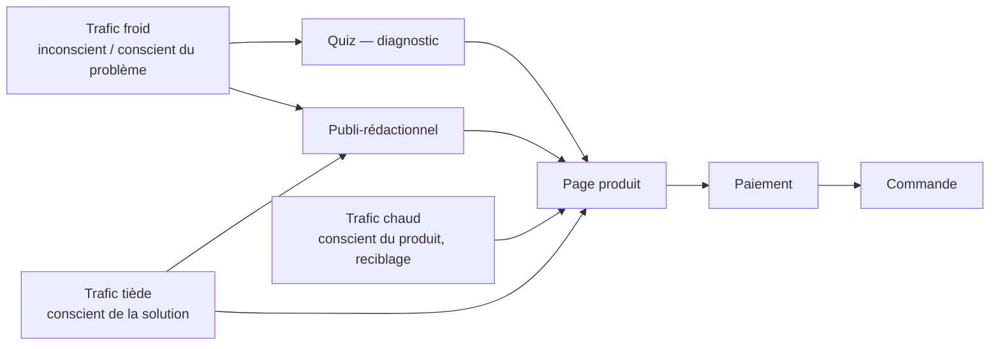

# Module E07 — Le funnel et la conversion

> **Prérequis :** [E01](E01-arithmetique-de-la-marque.md), [E03](E03-offre-et-prix.md), [E04](E04-psychologie-du-client.md), [E06](E06-acquisition-payante.md).
> **Objet :** transformer le trafic acheté en commandes, et savoir chiffrer en euros annuels ce que vaut chaque fraction de point de conversion gagnée — pour arbitrer entre un chantier de site, une négociation fournisseur et une hausse de budget média.
> **Temps de travail :** ~5 h (lecture + exercices)

---

## 0. Pourquoi ce module existe

Le taux de conversion n'est pas un indicateur de site. C'est **le prix auquel tu rachètes ton trafic**. Tu paies une session une fois ; le taux de conversion décide combien de sessions il te faut pour une commande, donc combien tu paies cette commande. Améliorer la conversion et négocier ton CPM produisent exactement le même effet comptable, à ceci près que la conversion ne se renégocie pas tous les trimestres avec une régie.

Chiffrons-le tout de suite, parce que c'est le seul argument qui compte.

*Hypothèse H0 :* le taux de conversion global de NØRA au palier P5 (sessions → commandes, tous trafics confondus) est de **2,50 %**. Ce chiffre ne figure pas dans les [chiffres canoniques](../donnees/chiffres-canoniques.md) ; il est déclaré ici et sert de base à tout le module.

Tu gagnes **0,2 point**, soit 2,50 % → 2,70 %. À dépense publicitaire constante — 1 494 206 € par mois (chiffres canoniques § 5) — le trafic ne bouge pas. Seules les commandes bougent.

```
Gain relatif de conversion   = 0,20 ÷ 2,50            = +8,0 %
Commandes supplémentaires    = 60 200 × 8,0 %          = 4 816 / mois
CA TTC supplémentaire        = 4 816 × 71,98 €         = 346 656 € / mois
CA HT supplémentaire         = 346 656 € ÷ 1,20        = 288 880 € / mois
Marge brute (CM2 = 2 218 957 ÷ 3 610 997 = 61,45 %)
                             = 288 880 € × 61,45 %     = 177 517 € / mois
Publicité et frais fixes     : inchangés
EBITDA annuel supplémentaire = 177 517 € × 12          = 2 130 199 €
```

(Commandes, AOV et structure de coût : chiffres canoniques § 2 et § 2.2.)

Vérification indépendante : les chiffres canoniques § 7 donnent **+2 662 749 €** d'EBITDA annuel pour +10 % relatif de conversion. Notre gain vaut 8,0 % relatif, soit 2 662 749 × 0,80 = **2 130 199 €**. Les deux chemins donnent le même euro. Le modèle tient.

Ce que ça veut dire, en trois lectures :

- **48,7 %** de l'EBITDA annuel de P5 (4 377 023 €, § 7) pour deux dixièmes de point.
- **40 965 € par semaine**, soit 11,9 % de la dépense publicitaire hebdomadaire (344 817 €, § 5). Gagner 0,2 point de conversion revient exactement à obtenir 11,9 % de remise sur tout ton média.
- Le nCAC passe de 40,03 € à 1 494 206 ÷ (37 324 × 1,08) = **37,07 €** (base : § 2.4). Tu n'as rien changé à tes enchères. Tu as changé le prix.
- **48,1 %** de l'écart entre P5 et P5+ (4 428 560 €, § 8). Presque la moitié de la vraie destination du cursus, dans un chantier qui ne demande ni euro de média ni recrutement.

> **À retenir :** un point de conversion ne se discute pas en pourcentage, il se discute en euros annuels. Tant que tu n'as pas écrit ce que vaut 0,1 point chez toi, tu ne peux arbitrer aucun chantier de site.

---

## 1. La chaîne complète et ses déperditions

### 1.1 Le bloc d'hypothèses

Aucun de ces taux n'est canonique. Ce sont des ordres de grandeur déclarés, cohérents avec une marque de soin premium vendue en Europe sur trafic social payant. Remplace-les par les tiens : la méthode ne change pas.

| Réf. | Hypothèse | Valeur |
|---|---|---:|
| H1 | CPM mixte, tous canaux, Europe, catégorie soin | 11,00 € |
| H2 | Taux de clic mixte | 1,25 % |
| H3 | Clics qui n'atteignent jamais une page chargée | 13,0 % |
| H4 | Session chargée → vue produit | 62,0 % |
| H5 | Vue produit → ajout au panier | 11,0 % |
| H6 | Ajout au panier → début de paiement | 48,0 % |
| H7 | Début de paiement → commande | 62,0 % |

### 1.2 La chaîne, en volumes mensuels au palier P5

Point de départ : la dépense média canonique de 1 494 206 € par mois (§ 5).

| Étape | Volume / mois | Taux de passage | Origine |
|---|---:|---:|---|
| Impressions | 135 836 909 | — | 1 494 206 € ÷ 11,00 € × 1 000 (H1) |
| Clics | 1 697 961 | 1,25 % | H2 — CPC dérivé : **0,88 €** |
| Sessions chargées | 1 477 226 | 87,0 % | H3 — coût par session : **1,01 €** |
| Vues produit | 915 880 | 62,0 % | H4 |
| Ajouts au panier | 100 747 | 11,0 % | H5 |
| Débuts de paiement | 48 358 | 48,0 % | H6 |
| **Commandes** | **29 982** | 62,0 % | H7 |

```
Taux composé session → commande    = 0,62 × 0,11 × 0,48 × 0,62 = 2,03 %
Taux composé clic → commande       = 29 982 ÷ 1 697 961         = 1,77 %
Taux composé impression → commande = 29 982 ÷ 135 836 909       = 0,0221 %
                                   soit 1 commande pour 4 531 impressions
```

### 1.3 Le chiffre que personne ne calcule : le taux de conversion n'existe pas

Le palier P5 fait 60 200 commandes par mois (§ 2). La chaîne payante ci-dessus en produit 29 982. Les 30 218 autres viennent d'ailleurs : e-mail, direct, organique, retour de client.

```
Sessions totales           = 60 200 ÷ 2,50 % (H0)   = 2 408 000
Sessions payantes          = 1 477 226              → 61,3 % du trafic
Sessions non payantes      = 2 408 000 − 1 477 226  = 930 774
Commandes non payantes     = 60 200 − 29 982        = 30 218
Taux de conversion payant     = 29 982 ÷ 1 477 226  = 2,03 %
Taux de conversion non payant = 30 218 ÷ 930 774    = 3,25 %
Taux de conversion global                            = 2,50 %
```

La part du trafic payant (61,3 %) n'est pas une hypothèse : c'est ce que l'arithmétique impose une fois posés le CPM, le CTR et le taux de conversion global. Retiens surtout ceci : **il n'existe pas de « taux de conversion du site »**. Il existe un taux payant, un taux non payant, et une moyenne qui bouge quand le mix bouge sans qu'aucune page n'ait été touchée (voir § 8.6).

### 1.4 Où l'argent se perd réellement

Deux endroits, et ce ne sont pas ceux qu'on travaille.

**Le clic qui n'arrive jamais.** 1 697 961 clics, 1 477 226 sessions : **220 735 clics payés pour rien** chaque mois.

```
Perte mensuelle = 220 735 × 0,88 € = 194 247 €
Perte annuelle                     = 2 330 964 €
```

Une partie est irréductible : robots filtrés, doubles clics, sorties d'application. *Hypothèse :* 5 points sur les 13 sont récupérables par le temps de chargement seul, soit 1 494 206 × 5 % = **74 710 € par mois**, **896 524 € par an**. C'est plus que la baisse de 10 % des frais fixes du § 7 (432 000 €), pour un chantier d'ingénierie sans conséquence sur l'organisation.

**Le paiement commencé et abandonné.** 48 358 personnes ouvrent le paiement chaque mois sur le trafic payant, 29 982 commandent. **18 376 abandons** — des gens qui ont saisi une adresse. En récupérer 10 % vaut 1 838 × 36,86 € = 67 748 € par mois, soit **812 976 € par an** (marge brute unitaire dérivée au § 4.1).

Entre les deux : la vue produit → ajout au panier, à 11 %. C'est là que tout le monde travaille, et c'est structurellement le taux le plus rigide de la chaîne, parce qu'il dépend de l'offre et du prix ([E03](E03-offre-et-prix.md)), pas de la page.

---

## 2. La cohérence publicité → page

### 2.1 Le mécanisme

Le visiteur arrive avec une attente formée moins d'une seconde plus tôt par ta publicité : une promesse, un visuel, trois mots. La première tâche de la page n'est pas de convaincre. C'est de **confirmer qu'il est au bon endroit**. Tant que cette confirmation n'a pas eu lieu, aucun argument n'est lu, parce que la page n'a pas encore obtenu le droit d'être lue.

D'où le résultat contre-intuitif : **une excellente page générique convertit moins bien qu'une page moyenne mais cohérente.** La page générique est bonne pour un visiteur moyen qui n'existe pas. La page cohérente est passable dans l'absolu et parfaite pour la seule personne qui la regarde — celle qui vient de voir cette publicité-là.

*Hypothèse :* 45 % des sessions se décident dans les trois premières secondes ; une rupture entre l'annonce et le haut de page fait passer le rebond immédiat de 22 % à 44 %. Tu as payé 1,01 € la session (§ 1.2) pour perdre un visiteur sur cinq de plus avant le premier mot.

Ce qui doit se retrouver au-dessus de la ligne de flottaison, et dans cet ordre : **la promesse exacte** (mêmes mots, pas des synonymes), **le visuel de l'annonce** (même image ou première image de la vidéo), **le vocabulaire du client** ([E04](E04-psychologie-du-client.md)), **le prix et l'offre**. Si la publicité dit « cheveux qui tombent après 40 ans », la page ne dit pas « densité capillaire ». Ce sont deux marques différentes pour le cerveau qui les lit.

### 2.2 Ce que ça implique : combien de pages faut-il maintenir ?

Les chiffres canoniques § 6 donnent au palier P5 : **57 concepts testés par semaine, 5,2 gagnants, 23 gagnants en rotation.** Si chaque gagnant a besoin de sa page, l'arithmétique de production tombe toute seule.

*Hypothèses :* un gagnant tourne en moyenne sur 3 des 7 marchés (§ 2) ; une déclinaison coûte 2,5 h (la trame existe, on change accroche, visuel, preuve, langue) ; une page active demande 0,5 h de maintenance par mois.

```
Production   = 5,2 gagnants × 3 marchés × 2,5 h            = 39,0 h / semaine
Parc actif   = 23 gagnants × 3 marchés = 69 pages
Maintenance  = 69 × 0,5 h / mois = 34,5 h / mois           =  8,0 h / semaine
Total                                                      = 47,0 h / semaine
                                                           ≈ 1,34 ETP
Part de l'effectif P5 (38 ETP, § 2.5)                      = 3,5 %
```

Et ce que ça rapporte. *Hypothèse :* les pages dédiées reçoivent 70 % du trafic payant, et la cohérence vaut +25 % relatif de conversion sur ce trafic.

```
Sessions concernées   = 1 477 226 × 70 %              = 1 034 058 / mois
Gain de conversion    = 2,03 % × 25 %                 = +0,507 point
Commandes de plus     = 1 034 058 × 0,507 %           = 5 247 / mois
Marge brute annuelle  = 5 247 × 36,86 € × 12          = 2 320 770 €
Coût (1,34 ETP chargé, hypothèse 60 000 €/ETP)        =   80 400 €
```

Rendement : **×29**. Contrôle de cohérence : ces 5 247 commandes valent +8,7 % relatif de conversion globale, soit 2 662 749 × 0,87 = 2 316 592 € selon le § 7. Écart de 0,2 %, imputable aux arrondis.

**Un studio de pages n'est pas un coût de site, c'est une extension de la machine créative** ([E05](E05-machine-creative.md)). Une marque qui produit 57 concepts par semaine et les envoie tous sur la même page d'accueil détruit la moitié du travail créatif à l'arrivée.

---

## 3. Les trois destinations



Toutes les routes finissent sur la page produit. C'est pour ça qu'elle n'est jamais optionnelle, quel que soit le reste du dispositif.

| Destination | Niveau de conscience ([E04](E04-psychologie-du-client.md)) | Conversion relative bout en bout | Coût de production (hypothèse) | Devient rentable quand |
|---|---|---:|---:|---|
| Page produit | Conscient du produit / de la solution | 1,00 (référence) | 1 500 – 4 000 € | Toujours. C'est le socle. |
| Publi-rédactionnel | Conscient du problème | 0,85 – 1,30 | 2 500 – 6 000 € | Le trafic froid dépasse ~40 % du média |
| Quiz / diagnostic | Inconscient / conscient du problème | 1,10 – 1,40 sur froid ; 0,60 – 0,80 sur chaud | 8 000 – 20 000 € + maintenance | Voir § 3.2 |

**Le publi-rédactionnel** vend le problème avant le produit. Il convertit souvent moins bien *sur la page* et mieux *de bout en bout*, parce qu'il filtre : les gens qui arrivent au bouton ont lu l'argument. Piège de mesure : si tu compares les deux formats sur le taux de conversion de la page, tu conclus toujours à tort. Compare sur **clic → commande**, jamais sur session → commande.

### 3.1 Le quiz : pourquoi il fonctionne

Trois mécanismes distincts, qu'on confond souvent en un seul.

1. **L'engagement.** Répondre à une question est un micro-engagement. La cohérence pousse ensuite à en accepter un plus grand. Le quiz ne vend pas mieux : il fabrique un interlocuteur là où il y avait un lecteur.
2. **La personnalisation.** La recommandation qui sort du quiz n'est plus un produit, c'est *ton* produit. La comparaison avec la concurrence devient difficile parce que l'objet comparé n'existe pas ailleurs sous cette forme.
3. **La donnée déclarative.** Le client te dit son âge, son type de cheveux, son problème, sa saison. Cette donnée survit à tout : elle alimente la segmentation de rétention ([E08](E08-retention-et-ltv.md)), les créations ([E05](E05-machine-creative.md)) et, en 2026, elle vaut d'autant plus que la donnée comportementale tierce s'est effondrée ([E09](E09-mesure-et-incrementalite.md)).

Le prix à payer : **la friction**. Chaque question perd du monde. Un quiz de 4 à 6 questions, une seule par écran, sans champ libre, avec une barre de progression honnête. Au-delà de 8 questions, tu paies la personnalisation plus cher qu'elle ne rapporte.

### 3.2 L'arbitrage chiffré

Au palier P5. *Hypothèses :* on route 15 % du trafic payant vers le quiz ; 62 % le démarrent ; 71 % des démarreurs le terminent ; les complétions convertissent à 5,2 % ; les abandons de quiz convertissent à 0,4 %.

```
Segment routé              = 1 477 226 × 15 %          = 221 584 sessions / mois
Sans quiz (TC payant 2,03 %)                           =   4 497 commandes
Complétions                = 221 584 × 62 % × 71 %     =  97 541
Commandes issues du quiz   = 97 541 × 5,2 %            =   5 072
Commandes des abandons     = 124 043 × 0,4 %           =     496
Total avec quiz                                        =   5 568 commandes
Écart                                                  =  +1 071 (+23,8 %)
Marge brute annuelle       = 1 071 × 36,86 € × 12       = 473 746 €
```

Coût an 1 (*hypothèse*) : 18 000 € de production + 2 500 €/mois d'outil et de maintenance = 48 000 €.

```
Seuil de rentabilité = 48 000 € ÷ 36,86 €    = 1 302 commandes / an
                                             =   109 / mois
                                             = +2,41 % sur le segment routé
```

**Le quiz est rentable dès qu'il fait mieux que +2,4 %. Il fait +23,8 %.** Décision évidente — à P5.

Refais le même calcul au palier P2. *Hypothèse :* le quiz capte un segment produisant 250 commandes par mois. Marge brute unitaire P2 = (57,55 ÷ 1,20) × 58,8 % = **28,20 €** (AOV § 2, CM2 § 2.1).

```
Gain à +23,8 %       = 60 commandes / mois → 20 134 € / an
Coût an 1                                  = 48 000 €
Seuil                = 48 000 ÷ 28,20 ÷ 12 = 142 commandes / mois
                                           = +56,7 % sur le segment
```

Verdict : **le quiz n'est pas un outil de P1–P2.** Non parce qu'il ne marche pas, mais parce que le coût fixe de production ne s'amortit pas sur le volume. C'est la règle générale de ce module : à petit volume, tout ce qui coûte cher à produire est faux, même quand c'est vrai.

---

## 4. L'anatomie d'une page produit qui convertit

### 4.1 La marge brute unitaire, qui sert à tout ce qui suit

```
AOV mixte P5 TTC                                    = 71,98 €  (§ 2)
AOV HT                       = 71,98 ÷ 1,20         = 59,98 €
CM2                          = 2 218 957 ÷ 3 610 997 = 61,45 % (§ 2.2)
Marge brute par commande     = 59,98 × 61,45 %      = 36,86 €
Contrôle : 60 200 × 36,86 €                         = 2 218 957 € ✓ (§ 2.2)
```

Chaque commande gagnée sur la page vaut 36,86 €. Chaque commande perdue aussi.

### 4.2 Ce que la page doit vendre, chez NØRA

L'AOV mixte est de 71,98 € TTC. Le sérum héros coûte 39,00 € TTC (§ 1). **La commande moyenne n'est donc pas un sérum.** Voici un mix qui reconstitue l'AOV canonique — c'est une *hypothèse de mix*, pas un chiffre canonique, mais elle doit boucler, et elle boucle.

| Référence | PVC TTC (§ 1) | Part des commandes (hypothèse) | Contribution à l'AOV |
|---|---:|---:|---:|
| Sérum Densité 50 ml seul | 39,00 € | 13 % | 5,07 € |
| Shampooing Fortifiant seul | 24,00 € | 6 % | 1,44 € |
| Masque Réparateur seul | 29,00 € | 6 % | 1,74 € |
| Rituel Complet | 74,00 € | 42 % | 31,08 € |
| Cure 3 mois | 99,00 € | 33 % | 32,67 € |
| **Total** | | **100 %** | **72,00 €** |

Écart avec l'AOV canonique de 71,98 € : 0,02 €, arrondi. **75 % des commandes sont un Rituel ou une Cure.** La page produit du sérum n'a donc pas pour objet de vendre un sérum : elle a pour objet de faire choisir le format à 74 € ou 99 €. Une page qui met le sérum seul en avant et propose la Cure en bas est arithmétiquement une page à 45 € d'AOV, et NØRA meurt à 45 € d'AOV — vérifie-le sur le MER seuil du § 2.3.

### 4.3 La structure, bloc par bloc

Dans l'ordre où le visiteur les rencontre, sur mobile.

| # | Bloc | Ce qu'il traite | Indicateur qui le mesure |
|---|---|---|---|
| 1 | Promesse (reprise mot pour mot de l'annonce) | « Suis-je au bon endroit ? » | Rebond sous 5 s |
| 2 | Preuve visuelle immédiate (produit en main, avant/après) | « Est-ce que ça a l'air réel ? » | Taux de scroll au-delà de 25 % |
| 3 | Note et nombre d'avis, en une ligne | « D'autres l'ont fait ? » | Clic sur la note |
| 4 | Choix d'offre et prix — Cure / Rituel / unité, la Cure présélectionnée | « Quoi et combien ? » | Part de la Cure dans les ajouts |
| 5 | Bouton d'ajout, visible sans scroll | Passage à l'acte précoce | Ajouts issus du premier écran |
| 6 | Barre de réassurance : livraison offerte au-delà de X, retour 30 j, paiement | Neutralise les coûts cachés | Abandon au paiement (§ 5) |
| 7 | Preuve sociale développée : 3 avis choisis pour 3 objections différentes | « Est-ce que ça marche pour quelqu'un comme moi ? » | Temps sur section, scroll |
| 8 | Mécanisme : pourquoi ça marche, en 3 étapes et un schéma | « Pourquoi je devrais y croire ? » | Scroll jusqu'au bloc |
| 9 | Preuve dure : test d'usage, panel, ingrédient, chiffre daté et sourcé | Ferme le doute rationnel | Taux de lecture |
| 10 | Objections traitées une par une, en accordéon | Les 5 raisons de ne pas acheter | Taux d'ouverture par objection |
| 11 | Garantie et inversion du risque | Transfère le risque du client vers toi | Ajouts après exposition ; taux de retour réel |
| 12 | Questions fréquentes (délai, usage, compatibilité, abonnement) | Les questions qui partent au SAV | Tickets SAV avant-vente |
| 13 | Rappel d'offre + bouton final | Rattrape le lecteur long | Part des ajouts venant du bas de page |

Trois remarques qui valent le reste de la section.

**Le bloc 10 se remplit par la recherche client, pas par l'imagination.** Les cinq objections sont lues dans les commentaires de tes publicités, les tickets SAV, les avis 3 étoiles de tes concurrents, et les motifs de retour. Cinq objections, cinq réponses, dans l'ordre de fréquence. Ce classement est le seul travail sérieux de la page.

**Le bloc 11 se chiffre.** Une garantie plus large augmente les commandes et les retours. Chiffres canoniques § 7 : **−1 point de taux de retour vaut 433 320 € d'EBITDA annuel**. Si passer de 30 à 90 jours de retour ajoute 1,2 point de retour, il faut que ça ajoute 433 320 × 1,2 ÷ 36,86 ÷ 12 = 1 176 commandes par mois pour être neutre, soit +2,0 % de commandes. C'est une décision arbitrable, pas une opinion.

**Le bloc 4 est le vrai levier d'AOV.** Chiffres canoniques § 7 : +10 % d'AOV vaut 3 139 401 € par an, contre 2 662 749 € pour +10 % de conversion. **Le sélecteur d'offre rapporte plus que le bouton.**

---

## 5. Le paiement, et ce qu'on récupère après

### 5.1 Les causes d'abandon, dans l'ordre

Par ordre d'importance décroissante, et chacune est réparable en jours, pas en trimestres.

1. **Les frais de port découverts tard.** Le client a mémorisé un prix. Tu en affiches un autre. Ce n'est pas le montant qui fait fuir, c'est la modification. Un port de 4,90 € annoncé sur la fiche produit coûte beaucoup moins qu'un port de 2,90 € révélé à l'étape 3.
2. **La création de compte obligatoire.** Un mur devant la caisse. Le compte se propose *après* le paiement, quand l'e-mail et l'adresse sont déjà saisis.
3. **Le moyen de paiement absent.** Voir § 5.3 — c'est la cause n° 1 sur un marché nouvellement ouvert, et elle est invisible depuis la France.
4. **Le délai de livraison.** Non annoncé, ou annoncé trop tard, ou annoncé en « 3 à 10 jours ouvrés », ce qui se lit « 10 ».
5. **Le doute sur le retour.** Qui paie, sous combien de jours, comment. Trois lignes, à l'étape de paiement, pas dans les CGV.

### 5.2 Ce que vaut 1 % de paniers récupérés

```
Ajout au panier → commande = 48 % × 62 %       = 29,76 %  (H6 × H7)
Paniers créés / mois       = 60 200 ÷ 29,76 %  = 202 285
Paniers abandonnés         = 202 285 − 60 200  = 142 085
1 % récupéré               = 1 421 commandes / mois
Marge brute mensuelle      = 1 421 × 36,86 €   = 52 373 €
Marge brute annuelle                           = 628 470 €
```

Compare : chiffres canoniques § 7, **−10 % de coût marchandise = 628 313 € par an.** Récupérer un pour cent des paniers abandonnés vaut donc exactement autant que renégocier dix pour cent de tout ton COGS. La première opération se fait avec un développeur en deux semaines ; la seconde demande un an de volume et un rapport de force.

### 5.3 Les moyens de paiement locaux

Au palier P5, NØRA vend sur sept marchés : FR, BE, DE, ES, IT, NL, UK (§ 2). Le paiement n'est pas un sujet technique, c'est un sujet local ([E11](E11-passage-a-echelle.md)).

| Marché | Ce qui manque coûte le plus cher |
|---|---|
| Pays-Bas | iDEAL. C'est le moyen de paiement en ligne dominant du pays ; l'absence de ce bouton n'est pas une friction, c'est une fermeture. |
| Allemagne | L'achat sur facture (*Rechnungskauf*) et le prélèvement SEPA. Payer après réception est une norme culturelle, pas une facilité. |
| Belgique | Bancontact. |
| Espagne | Bizum en complément carte. |
| Italie | Carte et portefeuilles, avec une présence résiduelle du paiement à la livraison. |
| Royaume-Uni | Cartes, portefeuilles mobiles, paiement fractionné. |

Chiffrage d'un seul bouton manquant. *Hypothèse :* les Pays-Bas représentent 8 % des commandes P5 et l'absence d'iDEAL fait tomber le taux de passage début de paiement → commande de 62 % à 38 %.

```
Commandes NL potentielles  = 60 200 × 8 %      = 4 816 / mois
Débuts de paiement NL      = 4 816 ÷ 62 %      = 7 768
Commandes réalisées à 38 % = 7 768 × 38 %      = 2 952
Perte                                          = 1 864 commandes / mois
Perte annuelle             = 1 864 × 36,86 × 12 = 824 599 €
```

**824 599 € par an pour un bouton.** C'est la ligne à sortir quand on te dira que l'intégration d'iDEAL n'est pas prioritaire ce trimestre.

### 5.4 Le paiement fractionné

Deux effets opposés : il augmente la conversion et l'AOV sur les paniers élevés ; il coûte 3,5 à 5,5 % de commission au lieu de 1,55 % de PSP (§ 2.1). L'arbitrage se calcule.

*Hypothèses :* le fractionné est proposé au-dessus de 60 €, donc sur le Rituel et la Cure — 75 % des commandes (§ 4.2) ; 25 % de ces commandes l'utilisent ; commission 4,5 % ; il apporte +7 % relatif de commandes sur ce segment.

```
AOV du segment TTC = (0,42 × 74 + 0,33 × 99) ÷ 0,75      = 85,00 €
AOV du segment HT                                        = 70,83 €
Marge brute du segment = 70,83 × 61,45 %                 = 43,53 €
Commandes du segment   = 60 200 × 75 %                   = 45 150 / mois

Surcoût = 45 150 × 25 % × 70,83 € × (4,50 % − 1,55 %)    =  23 586 € / mois
Gain    = 45 150 × 7 % × 43,53 €                         = 137 567 € / mois
Net                                                      = 113 981 € / mois
Net annuel                                               = 1 367 774 €
Seuil : 23 586 ÷ 43,53 = 542 commandes / mois            = +1,20 % relatif
```

*(La marge brute du segment, 43,53 €, coïncide numériquement avec la contribution par réachat du § 3. C'est un hasard arithmétique, sans relation entre les deux grandeurs.)*

Le fractionné est gagnant dès qu'il apporte **+1,2 %** de commandes sur son segment. La question n'est donc jamais « est-ce que la commission est chère », mais « est-ce que je sais mesurer +1,2 % ». Le § 7 t'explique pourquoi, en dessous de P3, la réponse est non — et qu'il faut décider quand même.

### 5.5 La récupération : relances de panier et de session

Une partie de ce qui est perdu au paiement se rattrape après. Les 60 200 commandes canoniques **incluent déjà** cette récupération : le calcul ci-dessous chiffre donc ce que tu perdrais en coupant la séquence, pas un gain à ajouter.

| Envoi | Délai | Contenu | Remise |
|---|---|---|---|
| 1 | 45 min – 1 h | Rappel du panier, image du produit, réassurance port et retour | Aucune |
| 2 | +20 h | Objection principale traitée, un avis, rappel garantie ; SMS si consentement | Aucune |
| 3 | +48 h | Rareté honnête (stock, fin d'offre réelle) et code limité | −10 % |
| 4 (session sans panier) | +4 h | « Voici ce que tu regardais » + guide de choix | Aucune |

*Hypothèses :* 30 % des paniers abandonnés sont identifiés (e-mail ou téléphone capturé) ; la séquence convertit 12 % des relançables ; 40 % des commandes récupérées portent le code −10 %, soit 4 % de remise moyenne sur le TTC, soit 2,40 € HT de marge en moins ; coût direct de la séquence à ce volume : 4 800 €/mois.

```
Relançables          = 142 085 × 30 %              = 42 625 / mois
Commandes récupérées = 42 625 × 12 %               =  5 115 / mois
                       soit 3,6 % des abandons et 8,5 % des commandes du palier
Marge nette de remise = 36,86 € − 2,40 €           = 34,46 €
Contribution mensuelle = 5 115 × 34,46 € − 4 800 € = 171 465 €
Contribution annuelle                              = 2 057 579 €
```

Ne t'arrête pas là. Une partie de ces clients serait revenue seule : la séquence encaisse une commande qu'elle n'a pas créée. *Hypothèse d'incrémentalité : 60 %* — à mesurer par un test de suppression sur un échantillon aléatoire, jamais par l'attribution de l'outil ([E09](E09-mesure-et-incrementalite.md)).

```
Valeur incrémentale annuelle = 2 057 579 € × 60 % = 1 234 547 €
```

C'est 28,2 % de l'EBITDA annuel de P5. Et c'est aussi la porte d'entrée de la rétention : ces clients récupérés entrent dans les cohortes du § 3 des chiffres canoniques, avec une contribution par réachat de 43,53 € et une LTV 12 mois de 86,75 € ([E08](E08-retention-et-ltv.md)).

---

## 6. La vitesse et le mobile — le même chantier

### 6.1 La vitesse

Fait public : l'étude *Milliseconds Make Millions* (Deloitte Digital pour Google, 2020) mesure sur un panel de sites que **0,1 seconde d'amélioration du temps de chargement mobile s'accompagne d'environ +8,4 % de conversion** dans la vente au détail. Traite-la pour ce qu'elle est : une corrélation sur un échantillon, pas une loi, avec un effet qui décroît fortement une fois passé sous les 2 secondes.

*Hypothèse de travail, volontairement plus prudente que le chiffre publié :* **−0,5 s de temps de chargement = +5 % relatif de taux de conversion.**

```
Gain = 2 662 749 € × 0,50 (§ 7, +10 % relatif) = 1 331 374 € / an
```

Coût du chantier (*hypothèse*) : 20 jours-homme d'ingénierie à 500 € et 1 200 €/an d'outillage = 11 200 €. **Rendement ×119.** Ajoute-lui les 896 524 € de clics récupérés entre le clic et la page (§ 1.4) : le même chantier travaille les deux bouts.

C'est le chantier le plus rentable et le moins glorieux du métier. Personne ne présente une réduction de poids de bundle JavaScript en comité. Il n'y a pas de capture d'écran à montrer, pas d'avant/après visuel, pas de mérite créatif. C'est exactement pour ça qu'il n'est jamais fait, et exactement pour ça qu'il rapporte : le rendement d'un chantier est inversement proportionnel au nombre de gens qui veulent y être associés.

Ce qui compte, par ordre d'effet : le poids et le format des images au-dessus de la ligne de flottaison ; le nombre de scripts tiers ; les polices personnalisées chargées avant le premier rendu ; les applications de la boutique qui s'exécutent sur toutes les pages alors qu'elles ne servent qu'à une. Repère public : **LCP au 75ᵉ centile ≤ 2,5 s** (seuil documenté des Core Web Vitals de Google). Mesure au 75ᵉ centile sur mobile en 4G, jamais sur ton ordinateur en fibre.

### 6.2 Le mobile

*Hypothèses :* 78 % des sessions et 73 % des commandes sont sur mobile.

```
Sessions mobile  = 2 408 000 × 78 %  = 1 878 240   Commandes = 43 946 → TC = 2,340 %
Sessions ordi.   = 2 408 000 × 22 %  =   529 760   Commandes = 16 254 → TC = 3,068 %
Écart relatif                                                          = +31,1 %
```

Cet écart est normal — le mobile porte plus de trafic froid — mais il n'est pas entièrement structurel. *Hypothèse :* un chantier mobile sérieux en récupère le tiers.

```
Gain = 0,728 point ÷ 3               = +0,243 point → TC mobile 2,583 %
Commandes de plus = 1 878 240 × 0,243 %              = 4 561 / mois
Marge brute annuelle = 4 561 × 36,86 € × 12          = 2 017 247 €
Contrôle § 7 : +7,58 % relatif global → 2 662 749 × 0,758 = 2 017 234 € ✓
```

Les contraintes réelles, qui expliquent l'écart :

- **La ligne de flottaison mobile fait environ 600 pixels de haut, pas 900 de large.** Sur ordinateur, promesse, visuel, prix et bouton tiennent côte à côte. Sur mobile ils s'empilent, et le bouton part sous le pli. Une page conçue en paysage puis « rendue responsive » place systématiquement son bouton au mauvais endroit.
- **Les zones cliquables.** Repères publics des guides de conception : **44 × 44 pt** (Apple Human Interface Guidelines), **48 × 48 dp** (Material Design). En dessous, tu ne mesures plus une intention, tu mesures une adresse de doigt.
- **Les formulaires.** Un champ = une ligne. Type de clavier correct (numérique pour le code postal, e-mail pour l'e-mail). Autocomplétion d'adresse. Remplissage automatique du navigateur non bloqué. Chaque champ supprimé au paiement se voit dans le taux du § 5.
- **Le pouce.** La zone atteignable d'une main couvre le bas et le centre de l'écran. Un bouton principal en haut à droite est un bouton pour ordinateur.

**Conçois sur un téléphone, à une main, dans le métro, avec 40 % de batterie.** Puis adapte à l'ordinateur. L'ordre inverse produit une page qui plaît en réunion et perd 31 % de conversion sur 78 % du trafic.

---

## 7. Tester quand on peut, trancher par principe quand on ne peut pas

### 7.1 La formule

Pour comparer deux taux de conversion, avec un risque de faux positif de 5 % et une puissance de 80 % :

```
n (sessions par variante) = (1,96 + 0,84)² × 2 × p (1 − p) ÷ (p × r)²
                          = 15,68 × (1 − p) ÷ (p × r²)

où p = taux de conversion de référence
   r = écart RELATIF à détecter (0,10 pour +10 %)
```

Multiplie par p et il se passe quelque chose de remarquable :

```
Conversions nécessaires par variante ≈ 15,68 ÷ r²
```

**Le nombre de conversions à collecter ne dépend pas de ton taux de conversion. Il ne dépend que de l'écart que tu veux détecter.** Un site à 1 % et un site à 5 % ont besoin du même nombre de commandes par variante ; le premier a simplement besoin de cinq fois plus de trafic pour les obtenir.

| Écart relatif à détecter | Conversions par variante | Total (2 variantes) | Durée à P5 (60 200 cmd/mois) | Durée à P2 (4 000 cmd/mois, test sur 45 % du trafic) |
|---:|---:|---:|---:|---:|
| +30 % | 174 | 348 | 0,2 jour | 6 jours |
| +20 % | 392 | 784 | 0,4 jour | 13 jours |
| +10 % | 1 568 | 3 136 | 1,6 jour | 1,7 mois |
| +5 % | 6 272 | 12 544 | 6,3 jours | 7,0 mois |
| +2 % | 39 200 | 78 400 | 40 jours | 3,6 ans |
| +1 % | 156 800 | 313 600 | 158 jours | 14,5 ans |

*(La correction (1 − p) réduit un peu ces nombres : à p = 2,5 % et r = 10 %, 1 529 au lieu de 1 568. Garde la version simple, elle est conservatrice.)*

### 7.2 Ce que ce tableau dit vraiment

**À P2, la quasi-totalité des tests sont ininterprétables.** Les vrais effets d'une modification d'interface sont de l'ordre de +2 à +5 %. Il te faudrait 7 mois pour un test à +5 % — sept mois pendant lesquels tu changeras d'offre, de créations, de mix de trafic et de saison. Ce que tu mesureras alors n'est pas ta variante : c'est décembre contre juin.

**À P5, tu peux tester sérieusement**, et c'est un des rares avantages structurels du volume. 1,6 jour pour +10 %, 6,3 jours pour +5 %. Tu peux tenir un rythme de deux tests concluants par mois sur le seul tunnel de paiement.

### 7.3 Ce qu'on fait à P1–P2, puisqu'on ne peut pas tester

On décide par **principe** et par **recherche client**. Ce n'est pas un pis-aller : c'est ce que font aussi les grandes marques pour tout ce dont l'effet attendu est sous le seuil de détection.

- **Les principes** sont ceux qui ont survécu à des décennies de tests chez d'autres, et qu'on n'a donc pas à retester : ne pas cacher un coût, ne pas imposer un compte, mettre la promesse au-dessus du pli, une question par écran, un champ de moins vaut mieux qu'un champ de plus.
- **La recherche client** remplace le test parce qu'elle a un rapport signal/bruit incomparablement meilleur. Dix entretiens de vingt minutes te donnent l'ordre des objections. Aucun test A/B ne te donne ça à P2, et l'ordre des objections vaut plus que n'importe quel gain de 3 %.
- **Les changements testables à P2 sont les gros changements** : une offre différente, un prix différent, une destination différente (§ 3). +30 % se détecte en six jours. Si tu ne peux tester que du gros, teste du gros — et arrête de tester du petit.

### 7.4 Le piège de l'arrêt au moment favorable

Tu lances un test. Tu regardes tous les jours. Au jour 6 la variante B est à p = 0,04. Tu arrêtes, tu déploies, tu annonces +9 %.

Tu viens de fabriquer un faux positif. Le seuil de 5 % ne vaut que pour **un seul regard, à une taille d'échantillon fixée d'avance**. Regarder plusieurs fois et s'arrêter à la première significativité, c'est se donner plusieurs chances de tomber sur le hasard. Résultat classique de la théorie des tests séquentiels (Armitage et al., 1969) : avec cinq regards, le taux réel de faux positifs monte autour de 14 % ; avec un regard quotidien sur un mois, il dépasse 25 %.

Les conséquences sont pires que le test perdu. Tu déploies une variante neutre, ton taux ne bouge pas, tu conclus que la conversion « ne se travaille pas », et tu remets le budget sur le média. Une décision de portefeuille prise sur un artefact statistique.

Trois règles, non négociables :

1. **Calcule la taille d'échantillon avant de lancer** et écris la date de fin. Le test s'arrête à cette date, pas avant.
2. **Ne regarde pas les résultats intermédiaires**, ou regarde-les en sachant qu'ils ne décident rien. Si tu ne peux pas t'en empêcher, utilise une méthode séquentielle prévue pour ça, qui ajuste le seuil au nombre de regards.
3. **Une seule métrique de décision, choisie d'avance.** Le taux de conversion, ou le CA par session, pas les deux. Tester dix indicateurs jusqu'à ce que l'un soit significatif, c'est la même erreur sous un autre nom.

---

## 8. Les erreurs qui coûtent cher

**8.1 — Tester la couleur d'un bouton pendant que la promesse est fausse.**
Un changement de couleur produit typiquement moins de 1 % d'écart relatif. Table du § 7.1 : 156 800 conversions par variante, 313 600 au total, soit **158 jours à P5 et plus de quatorze ans à P2**. Le test est mathématiquement impossible, et le temps passé est le vrai coût. Pendant ce temps, la promesse en haut de page n'est pas la promesse de l'annonce — un défaut qui vaut, lui, 2 320 770 € par an (§ 2.2).

**8.2 — La refonte complète sans mesure.**
Tu changes tout en une nuit. Si la refonte perd 8 % relatif de conversion, tu perds 2 662 749 × 0,80 = **2 130 199 € par an** (§ 7 des chiffres canoniques). Et tu ne peux pas revenir en arrière sur la partie fautive, puisque tout a bougé ensemble. Une refonte se déploie par blocs, dans l'ordre de la table du § 4.3, avec une mesure entre chaque.

**8.3 — Empiler les fenêtres surgissantes.**
*Hypothèse :* trois fenêtres (bienvenue, roue, intention de sortie) coûtent 6 % relatif de conversion et rapportent 2,5 points de capture d'e-mail.

```
Perte  = 2 662 749 € × 0,60                       = 1 597 649 € / an
Gain   = 2 408 000 × 2,5 % = 60 200 e-mails/mois  =   722 400 / an
         à 0,80 € de contribution annuelle par e-mail (hypothèse)
                                                  =   577 920 € / an
Net                                               = −1 019 729 € / an
```

Le calcul se retourne si la valeur d'un e-mail dépasse 2,21 € par an (1 597 649 ÷ 722 400). **Fais ce calcul avec ta vraie valeur d'e-mail** ([E08](E08-retention-et-ltv.md)) avant d'installer la troisième fenêtre. Une seule fenêtre bien placée est presque toujours gagnante ; c'est l'empilement qui tue.

**8.4 — Cacher les frais de port jusqu'à l'étape 3.**
*Hypothèse :* +6 points d'abandon au paiement.

```
Débuts de paiement totaux = 60 200 ÷ 62 %        = 97 097 / mois
Commandes perdues         = 97 097 × 6 %         =  5 826 / mois
Perte annuelle            = 5 826 × 36,86 × 12    = 2 576 871 €
```

**2,58 M€ par an pour avoir déplacé une ligne de trois mots.** Annonce le port sur la fiche produit, ou intègre-le au prix et affiche « livraison offerte » — mais vérifie alors le coefficient au § 1 des chiffres canoniques avant de le faire.

**8.5 — Promettre un délai de livraison qu'on ne tient pas.**
*Hypothèses :* 12 % des commandes arrivent hors du délai annoncé ; ces clients réachètent 40 % de moins.

```
Clients touchés / mois  = 37 324 × 12 %                = 4 479   (§ 2.4)
Part réachat de la LTV 12 mois = 86,75 − 32,77         = 53,98 € (§ 3)
Perte par client        = 53,98 × 40 %                 = 21,59 €
Perte annuelle          = 4 479 × 21,59 × 12           = 1 160 496 €
```

Le gain de conversion obtenu en annonçant « 48 h » au lieu de « 3 à 5 jours » est réel et immédiat. La perte est différée, invisible dans le tableau de bord de conversion, et strictement supérieure. C'est le cas type d'un gain de funnel payé par la rétention ([E08](E08-retention-et-ltv.md)) — et par les opérations ([E10](E10-cash-et-operations.md)).

**8.6 — Lire le taux de conversion global sans le segmenter.**
Ton taux payant est de 2,03 %, ton taux non payant de 3,25 % (§ 1.3). Si la part du trafic payant passe de 61,3 % à 55 % — parce que tu as coupé une campagne, ou parce qu'une vidéo organique a marché :

```
Commandes = 2 408 000 × 55 % × 2,03 % + 2 408 000 × 45 % × 3,25 % = 62 059
Taux global = 62 059 ÷ 2 408 000                                  = 2,58 %
```

**+0,08 point sans qu'une seule page ait changé.** Une équipe qui présente ça comme le résultat d'un chantier n'a rien optimisé du tout. Segmente toujours par source, et compare des périodes à mix constant. C'est le prolongement direct du problème d'attribution traité en [E09](E09-mesure-et-incrementalite.md).

**8.7 — Confondre coût par commande attribuée et nCAC.**
Notre chaîne payante produit 29 982 commandes pour 1 494 206 € :

```
Coût par commande issue du clic payant = 1 494 206 ÷ 29 982 = 49,84 €
nCAC canonique (§ 2.4)                                      = 40,03 €
Écart                                                       = +24,5 %
```

Ces deux chiffres ne mesurent pas la même chose. Le second divise la même dépense par *tous* les nouveaux clients, y compris ceux qui sont arrivés par une session organique après avoir vu la publicité. **L'écart de 24,5 % est la mesure du halo que le dernier clic ne voit pas** — le pendant exact des 11 % de sur-attribution signalés au § 5 des chiffres canoniques. Piloter un budget sur le coût par commande attribuée conduit à couper des campagnes qui gagnent.

---

## 9. Ce que ce module ne dit pas

**Que les gains calculés ici s'additionnent.** Ils ne s'additionnent pas. Le gain de vitesse (§ 6.1), le gain mobile (§ 6.2), le gain de cohérence (§ 2.2) et le gain de paiement (§ 5) portent en partie sur les mêmes commandes. Additionner ces sections donne plus de 8 M€ d'EBITDA annuel supplémentaire, ce qui dépasse l'EBITDA de P5+ (§ 8). Chaque chiffre est valide *contre la situation actuelle, toutes choses égales par ailleurs* ; leur somme ne l'est pas. Chiffre les chantiers un par un, exécute-les dans l'ordre du rendement, et re-mesure la base après chacun.

**Que le taux de conversion peut monter indéfiniment.** Il a un plafond structurel imposé par la catégorie et le prix, et ce plafond ne se franchit pas avec du travail de page. Ordres de grandeur déclarés :

| Catégorie et prix | Plage de conversion usuelle |
|---|---:|
| Consommable sous 40 €, achat répété | 3 – 6 % |
| Soin premium 40 – 100 € (le terrain de NØRA) | 2 – 4 % |
| Équipement 150 – 400 € | 0,8 – 1,8 % |
| Bien considéré au-delà de 500 € | 0,3 – 0,8 % |

NØRA à 2,50 % est dans le haut du milieu de sa plage. Passer à 3,2 % est difficile mais atteignable ; viser 6 % est une erreur de catégorie, pas un objectif ambitieux. Un site qui affiche 6 % dans cette plage de prix ne convertit pas mieux : il a un mix de trafic différent, et probablement beaucoup de reciblage compté comme acquisition.

**Qu'au-delà de ce plafond, le levier reste le site.** Il ne l'est plus. Chiffres canoniques § 7 : +10 % d'AOV vaut 3 139 401 € contre 2 662 749 € pour +10 % de conversion — **17,9 % de plus**. Et le § 8 est encore plus net : le passage de P5 à P5+ (+4 428 560 € d'EBITDA annuel) se fait sans un euro de CA supplémentaire, avec un panier plus élevé, plus de réachat et moins de remise. Quand la conversion touche son plafond, le chantier suivant s'appelle l'offre et le prix, et il est traité en [E03](E03-offre-et-prix.md).

**Que la conversion mesure le site.** Elle mesure le produit du site, du trafic, de l'offre, du prix, de la saison et de la notoriété. Ce module isole la part attribuable au site en supposant tout le reste constant — supposition confortable et fausse dès que tu changes de mix média. Les méthodes qui permettent de séparer ces effets sont en [E09](E09-mesure-et-incrementalite.md).

**Ce qui n'est pas traité ici :** la rétention et la valeur des cohortes ([E08](E08-retention-et-ltv.md)), l'attribution et l'incrémentalité ([E09](E09-mesure-et-incrementalite.md)), les conséquences opérationnelles d'une promesse de délai ([E10](E10-cash-et-operations.md)), et le fait qu'une hausse de conversion accélère la consommation de trésorerie via le BFR (§ 4 des chiffres canoniques, et [E13](E13-risque-de-ruine.md)). Plus de commandes, c'est plus de stock à financer avant d'être payé.

---

## 10. Le tableau de bord du module

Six lignes, hebdomadaires, segmentées payant / non payant. Aucune n'est un pourcentage isolé : chacune a un seuil qui déclenche une action.

| # | Indicateur | Valeur de référence P5 | Seuil d'alerte | Ce que l'alerte signifie |
|---|---|---:|---|---|
| 1 | Taux de conversion **payant** | 2,03 % | −8 % sur 2 semaines à mix de campagnes constant | La page ou l'offre décroche — pas le média |
| 2 | Écart clic → session chargée | 13,0 % | > 18 % | Tu paies des clics qui n'arrivent pas (§ 1.4) |
| 3 | Coût par session payante | 1,01 € | +15 % à CPM constant | Le CTR ou la page d'atterrissage se dégrade |
| 4 | Début de paiement → commande | 62,0 % | < 58 % | Frais, moyen de paiement ou délai (§ 5) |
| 5 | LCP mobile, 75ᵉ centile | — | > 2,5 s (seuil public Core Web Vitals) | Chantier vitesse, rendement ×119 (§ 6.1) |
| 6 | Récupération des paniers relançables | 12,0 % | < 8 % | La séquence est cassée ou la délivrabilité a chuté |

Deux règles d'usage. **Un indicateur global sans segmentation ne déclenche jamais rien** — voir l'erreur 8.6. Et **toute alerte se convertit en euros annuels avant d'être arbitrée** : 1 point de conversion payante vaut, à ce palier, environ 2 662 749 ÷ 10 × (1 ÷ 0,203) ≈ 1,31 M€ par an rapporté à la seule chaîne payante. C'est ce chiffre qui décide de l'ordre des chantiers, pas la couleur de la case dans le tableau.

> **À retenir :** tu ne pilotes pas un taux de conversion, tu pilotes un prix d'achat de commande. Coût par session ÷ taux de conversion = ce que tu paies une commande. Les deux termes se travaillent, et le second est gratuit.

---

## 11. Exercices

À rendre dans [`ecommerce/exercices/E07-rendu.md`](../exercices/E07-rendu.md). Corrigé dans [`E07-corrige.md`](../exercices/E07-corrige.md).

**Exercice 1 — La chaîne de NØRA, refaite avec un CPM dégradé.**
Reprends la chaîne du § 1.2 avec un CPM de 14,00 € au lieu de 11,00 €, tous les autres taux inchangés, et la dépense canonique de 1 494 206 €/mois (§ 5). Calcule : impressions, clics, CPC, sessions payantes, coût par session, commandes payantes, et le coût par commande issue du clic payant. Réponse numérique unique.

**Exercice 2 — Le seuil de conversion qui rend P5 déficitaire.**
En partant du § 0 et des chiffres canoniques § 2.2 (EBITDA P5 = 364 752 €/mois, marge brute unitaire dérivée 36,86 €), calcule de combien de points le taux de conversion global peut baisser, à dépense publicitaire et frais fixes constants, avant que l'EBITDA mensuel n'atteigne zéro. Exprime le résultat en points absolus et en pourcentage relatif, puis compare-le à l'écart au seuil de MER du § 2.3 (+24,4 %). Les deux mesures disent-elles la même chose ?

**Exercice 3 — Ta chaîne réelle.**
Sur tes 90 derniers jours, remplis la table du § 1.2 avec tes chiffres : impressions, clics, sessions, vues produit, ajouts, débuts de paiement, commandes. Calcule les sept taux de passage, le taux composé, ton coût par session et ton coût par commande attribuée. Sépare payant et non payant. La correction est une grille de lecture : elle te dit lequel de tes taux est hors norme, et dans quel ordre attaquer.

**Exercice 4 — La valeur d'un point de conversion chez toi.**
Refais le calcul du § 0 avec tes chiffres : commandes/mois, AOV TTC, taux de TVA, taux de marge brute, dépense publicitaire. Donne la valeur annuelle en EBITDA de +0,1 point, +0,2 point et +0,5 point de conversion. Puis compare ces trois montants au coût complet du chantier qui les produirait. Écris la phrase de conclusion sous la forme : « chez moi, 0,1 point vaut X € par an, donc je peux justifier jusqu'à Y jours-homme sur ce chantier. »

**Exercice 5 — Ton test est-il faisable ?**
Prends le prochain test que tu comptes lancer. Estime honnêtement l'écart relatif attendu, applique la formule du § 7.1, et calcule la durée nécessaire à ton volume actuel de commandes sur le segment testé. Si elle dépasse six semaines, écris la décision que tu prendras **sans test** et le principe sur lequel tu la fondes (§ 7.3).

**Exercice 6 — Décision : le quiz ou la vitesse ?**
Tu es au palier P3 (chiffres canoniques § 2 et § 2.2 : 18 000 commandes/mois, AOV 65,40 € TTC, CM2 60,3 %, pub 436 000 €/mois, EBITDA 51 033 €/mois). Tu disposes de 45 000 € et d'un trimestre d'équipe, et tu dois choisir :
**Option A** — un quiz de diagnostic sur 15 % du trafic payant, avec les hypothèses de rendement du § 3.2 ;
**Option B** — un chantier vitesse, avec l'hypothèse de rendement du § 6.1.
Chiffre les deux en EBITDA annuel, tranche, et justifie. La correction donne la bonne réponse **et** la condition précise sous laquelle l'autre option devient la bonne — indice : elle porte sur la part de trafic froid et sur ton LCP actuel.

---

*Fin du module E07. Suite : [E08 — La rétention, les cohortes et la LTV](E08-retention-et-ltv.md), qui reprend les commandes que ce module a fait entrer et démontre que le prix payé pour la première n'a de sens qu'au regard de la troisième.*
